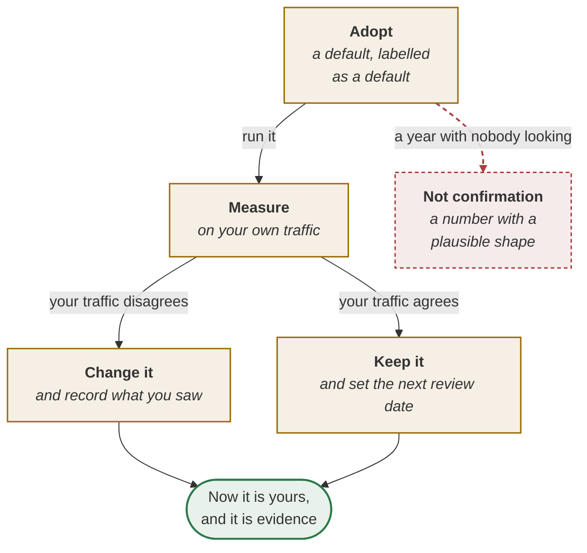

# Sources and confidence

Every claim in this playbook carries one of three marks. The point of the marks is to let you argue
with the right things: a documented price is checkable, a working method is a default to tune, and
confusing the two wastes everybody's time.

| Mark | Means | How to treat it |
| --- | --- | --- |
| **documented** | From a vendor's published documentation, read on a date | Check it. Prices and limits change |
| **established** | A named, published practice with an author and a year | Standard. Read the source if you want depth |
| **working method** | This playbook's own construction | A **default to tune on your own traffic**, not a standard |

> The documented figures were read in **September 2026** and will change. The working-method
> thresholds are starting points, not findings.

This page is longer than a source list because a source list is not the hard part. The hard part is
knowing what a number entitles you to say — in a gate, in a business case, in front of a regulator —
and that is what the sections below are for.

---

## How to read a confidence mark

A mark is not a quality rating. It says where a claim came from, and that decides what you may do
with it and what you owe before you act on it.

### documented — what it means operationally

A vendor published it and somebody here read it on a stated date. That is the whole claim. It does
not say the figure is correct, that it applies to your region, your model or your contract, or that
it is still true this morning.

**You are entitled to** quote it with its date attached, build the arithmetic of a business case on
it, and put it into a cost model. Its value is that it is *settleable*: anyone who disagrees can
open the same page and the argument ends in a minute.

**You must not** quote it without the date, carry it across models or regions without re-reading, or
read it as a promise about behaviour. A published price is a price. Latency, availability and
quality are not documented here at all, and a vendor's documentation is not a contract — your
agreement is.

### established — what it means operationally

A named, published practice with an author and a year, in the literature long enough to have known
failure modes. Some of it is mathematics — Wilson (1927), Little (1961) — and some of it is method
with a published description and worked examples, such as ATAM or EARS.

**You are entitled to** use it without re-deriving it, cite the lineage in a decision record, and
expect a reviewer to accept the method without an argument about its validity. The live question is
*applicability*, never correctness.

**You must not** treat a method as an outcome: ATAM tells you how to find sensitivity points, not
which ones you have. And the mathematics assumes what it assumes — Wilson assumes independent
samples, Little's law assumes a stable queue and interchangeable servers, `pⁿ` assumes steps that do
not correlate. A formula used outside its assumptions is wrong with a citation attached, which is
harder to catch than being wrong plainly.

### working method — what it means operationally

This playbook's own construction. It has worked somewhere, and it exists so that a team has
something to run on Monday instead of a blank field.

**You are entitled to** adopt it as a default and change it the moment your own traffic says
otherwise. That is the intended lifecycle, not a failure of the default.

**You must not** present it to a governance forum as evidence, defend it on authority, or leave it
untouched for a year and call that confirmation. A default you have measured and changed is worth
more than a default you inherited; a default nobody has examined is a number with a plausible shape.

| Mark | What to argue about | What settles it | Owed before you act on it |
| --- | --- | --- | --- |
| **documented** | Whether it still says that | Opening the vendor's page | The date, and a re-read on it |
| **established** | Whether it applies here | The assumptions behind it | Naming the assumption you are relying on |
| **working method** | What the number should be | Your own traffic | A measurement, and a review date |

---

## Where each mark may be used

The tables above say what a mark *means*. This says where you may spend it. Read down your own
column: the entitlement changes with the room you are standing in, and only one cell on this page
says no.

| | In a business case | At a gate | In front of a regulator or an auditor |
| --- | --- | --- | --- |
| **documented** | Yes, with the date beside it | Yes | Yes, with the date and the page that said it |
| **established** | Yes | Yes, naming the assumption you are relying on | Yes, with the lineage cited |
| **working method** | Yes, if it is labelled as a default | Only if you have measured it on your own traffic | **No.** Your measurement may go. The default may not |

**The bottom-right cell is the one that gets crossed**, and it rarely looks like a lie when it
happens. A working method quoted to a governance forum is this playbook's number wearing your
evidence's clothes: it has a plausible shape, a decimal point and no traffic behind it. The fix is
not to stop using working methods — it is to measure one before it has to stand up.

### The lifecycle of a working method

Changing a default is not the default failing. It is the default doing the only job it was built
for, which is to give a team something to run on Monday instead of a blank field.



Both paths out of **Measure** end in the same place. That is the part worth saying out loud: a
default you kept *after measuring it* is worth exactly as much as one you changed, and neither is
worth anything until somebody has looked.

---

## Check a documented figure yourself

A documented figure is the only kind you can verify without running an experiment, and verifying one
takes about ten minutes. Do it before a business case rests on it, and again on the date you wrote
down.

1. **Open the vendor's own page, not a summary.** Blog posts, conference slides and this wiki are
   all downstream. The pricing page and the specification are the source.
2. **Read the unit before you read the number.** A cache write at 1.25× is 1.25× *the input price
   for that model*, not 1.25× a blended rate and not 1.25× the output price. Most misquoted figures
   are correct numbers attached to the wrong unit.
3. **Collect the qualifiers.** Minimums, model families, regions, expiry windows. The ~1,024-token
   minimum and the model scoping are not footnotes — they are the difference between a saving and a
   surcharge.
4. **Write what you read in your own words, with the URL and the date.** A figure with no date is a
   rumour with a decimal point.
5. **Check one arithmetic consequence against your own bill.** Model one day of real traffic and
   compare it with the invoice for that day. Agreement within a few percent means you read it
   correctly; a gap means either your reading is wrong or something structural changed, and both are
   worth knowing before the figure goes into a slide.
6. **Set the next check date.** Monthly for prices, quarterly for protocol and product behaviour,
   and immediately after any vendor announcement that touches the area.
7. **Record where the figure is used, not only what it says.** A price that moved is only useful if
   the change reaches the cost model, the decision record and the business case that quoted it.

<details><summary><b>Template · Figure verification log</b></summary>

```markdown
# Figure verification log · <team> · owner: <name>

One row per figure this team relies on. A figure with no row is a figure nobody owns.

## The figures
| Figure | Source (URL or document) | Date read | Value as read | Unit and qualifiers | Next check due | Read by |
|--------|--------------------------|-----------|---------------|---------------------|----------------|---------|
| Five-minute cache write | <vendor pricing page> | <2026-09-xx> | 1.25x | x INPUT price, per model; ~1,024-token minimum | <2026-10-xx> | <name> |
| One-hour cache write | <vendor pricing page> | <2026-09-xx> | 2x | x input price | <2026-10-xx> | |
| Cache read | <vendor pricing page> | <2026-09-xx> | 0.1x (0.025x on <model>) | model-scoped; refresh free on hit (5 min) | <2026-10-xx> | |
| Batch rate | <vendor batch page> | <2026-09-xx> | ~50% of on-demand | results within a day | <2026-12-xx> | |
| <our negotiated rate> | <contract section> | | | | | |

## Where each figure is used — so a change has somewhere to land
| Figure | Cost model | ADR | Wiki / doc page | Business case or slide |
|--------|-----------|-----|-----------------|------------------------|
| <cache read> | <file> | ADR-<n> | <page> | <deck, slide n> |

## The arithmetic check
Date: <date>. One day of real traffic: modelled $<n>, invoiced $<n>, ratio <n>.
Outside 0.95-1.05 the reading is wrong OR something structural changed. Which: <answer>.

## Changes since the last check
| Date | Figure | Was | Now | What it changed downstream | Who was told |
|------|--------|-----|-----|---------------------------|--------------|
| | | | | | |

## Figures we rely on and CANNOT verify
| Figure | Why not | What we do instead |
|--------|---------|--------------------|
| <a partner's throughput claim> | <no published source> | <measure it ourselves, monthly> |
```
</details>

---

## Documented

| Claim | Source | Last read |
| --- | --- | --- |
| Cache write 1.25× input for five minutes, 2× for one hour; read 0.1× (Fable and Mythos 5.1 at 0.025×); ~1,024-token minimum; model-scoped; five-minute cache refreshes free on hit | Anthropic and Amazon Bedrock prompt-caching documentation | **September 2026** |
| Batch processing at about half the on-demand rate, results within a day | Anthropic and Amazon Bedrock batch documentation | **September 2026** |
| MCP: a server exposes tools, resources and prompts; stdio locally, Streamable HTTP in production; consequential calls designed for human review | Model Context Protocol specification | **September 2026** |
| Context files: `CLAUDE.md`, `.github/copilot-instructions.md` (plus scoped `*.instructions.md`), `AGENTS.md`, `.cursor/rules/*.mdc`. Copilot's steers inline suggestions; Claude Code's drives autonomous actions | Anthropic, GitHub, OpenAI and Cursor documentation | **September 2026** |
| A model gateway giving routing, budgets, fallbacks and a per-call log | LiteLLM, as the named example | **September 2026** |

The cache row carries five separate figures and the fifth is the one that gets dropped in
retelling: the cache is **model-scoped**, so a team that switches model mid-task pays every write
again. Quote the row, not the headline.

---

## Established

| Practice | Source | What it gives us here |
| --- | --- | --- |
| Utility trees, sensitivity points, trade-off points | ATAM — Kazman, Klein and Clements, SEI, 2000 | `priority = value × (4 − complexity)`, and the ADR trigger |
| Six-part quality attribute scenarios | Bass, Clements and Kazman | Source · stimulus · artefact · environment · response · measure |
| EARS acceptance syntax | Mavin, Wilkinson, Harwood and Novak, Rolls-Royce, 2009 | The acceptance format a spec-driven tool can read |
| Architecture decision records | Nygard, 2011; MADR | One record per sensitivity point, and nowhere else |
| Walking skeleton | Cockburn, *Crystal Clear*, 2004 | Day one of every bolt plan |
| Risk-first ordering | Boehm, 1988 | Cut by dependency and unknown, not by priority |
| One-way and two-way doors | Bezos, 2015 letter to shareholders | How much evidence a decision owes before it is taken |
| Least privilege | Saltzer and Schroeder, 1975 | Read separated from write in the authority budget |
| Layered defences | Reason, 1990; *BMJ*, 2000 | The layer table in a missing-control postmortem |
| Blameless postmortems | Beyer and colleagues, *Site Reliability Engineering*, 2016 | The question is the missing control, not the person |
| Strangler Fig | Fowler, 2004 | Route a slice, grow the new, retire the old |
| Little's law | Little, 1961 | Queue time = slots needed ÷ slots per day |
| Confidence bounds for a proportion | Wilson, 1927 | The lower bound that proves — or fails to prove — a bar |
| Stratified sampling | Neyman, 1934 | A sample per slice, rather than one pooled sample |
| Concept selection by weighted matrix | Pugh, 1981 | The build/buy/borrow score, and the flip test |
| Total cost of ownership | Gartner, 1987 | The three-year cost with the people counted |
| Stage-gate systems | Cooper, 1990 | The five gates, and what evidence each needs |
| Paired indicators | Grove, 1983 | Every measure reported beside its side effect |
| Goodhart's law | 1975 | Why a single number gets pushed |
| Conway's law | Conway, 1968 | Why the integration seam follows the team boundary |
| Shadow deployment, canary release, LLM-as-a-judge | General practice | The evidence ladder before a cut-over |
| The **bolt** as a work cycle of hours or days | AWS AI-Driven Development Lifecycle (AI-DLC) | The unit that replaces the sprint story |

Two of these are cited more loosely than the rest, and it is worth saying so. "General practice"
means exactly that — shadow deployment and LLM-as-a-judge are widely used and have no single
canonical paper, so treat the *technique* as established and any *threshold* attached to it as a
working method. And Goodhart's law is a remark about economic policy that the software industry has
adopted; it is an established idea, not an established measurement.

---

## The working methods, and how to tune each

These have no external source. They are offered as defaults because they have worked, and they are
the parts you should expect to change as you measure.

The structural constructions — argue with their shape, not with a number:

- The **P0–P3 phase names** and the eight-loop ring
- The **hard and soft gate split**, and the four classification questions
- The **minimum artefact set** at each hand-off
- The **eight-field spec** and its reading test
- The **acceptance bar** formula, and the hold as a documented lever
- The **exact / best-guess / consequential** map and its proof column
- The **R1–R5 risk ladder** and routing review by band
- The **four bill signatures** and the `(factor − 1) ÷ days` fix order
- The **two-number report** and its net line
- The **maturity ladder** of six controls

The numeric defaults get an entry each below: what the number is a default *for*, what evidence
would move it, which way it moves in practice, and what breaks at each extreme. **Every one of them
should have moved at least once by the end of your first year.**

### 5% drift alert

**A default for** — how far a watched output mix may move, week on week, before the alert fires and
re-opens the release gate.

**What would move it** — the measured natural variation of that mix across a period when nothing
changed. Two months of weekly figures gives you the noise band, and the threshold belongs just
outside it.

**Which way it moves in practice** — up, to seven or ten percent, after a first month of alerts on
ordinary seasonal traffic. Down only on a mix that has proven itself stable.

**Too low** — the alert fires weekly on noise, the gate re-opens so often that re-opening stops
meaning anything, and somebody mutes the alert rather than investigating the traffic.

**Too high** — the mix moves for six weeks before anyone looks, which is precisely the failure the
alert exists to catch: no deploy, no error, and a slow change of behaviour.

### 95% shadow agreement over 14 days

**A default for** — the evidence that ends a shadow run and permits a first cut-over.

**What would move it** — the desk's agreement with *itself*. Give two experienced people the same
forty cases and measure how often they choose the same answer; a bar above human self-consistency
cannot be reached by anything, including another human.

**Which way it moves in practice** — the percentage usually comes down, towards the desk's own
measured figure, and the **window** usually lengthens instead. Fourteen days sees a normal fortnight
and no month-end.

**Too low** — you cut over on a system that disagrees with the desk once in ten cases, and the
disagreements are not randomly distributed; they cluster in the slice you were least sure about.

**Too high** — 99% agreement is unreachable, the shadow run never ends, and the team concludes that
measurement is the obstacle rather than the design.

### 5% first cut-over

**A default for** — the share of live traffic the agent handles on the first day it acts.

**What would move it** — the arithmetic of days of live evidence, `days = cases needed ÷ (share ×
cases per day)`, set against how long the programme can wait, and the cost of a first-day failure
reaching a customer.

**Which way it moves in practice** — up, in deliberate steps — 5%, then 25%, then all of it — as
each slice holds. Down only where the action is irreversible.

**Too low** — at 1% of 240 cases a day you see two cases a day, so five hundred cases takes most of
a year. The evidence never arrives and the pilot dies of slowness rather than of quality.

**Too high** — at 50%, half your customers meet the first-day failure, and the first day is when the
unknown conditions arrive.

### `MAX_LOOPS = 5`

**A default for** — the number of reasoning loops before a hard stop and a hand-off to a person.

**What would move it** — the distribution of loop counts across cases that *ended correctly*. Put
the cap above the 99th percentile of successful runs; anything beyond that is not working, it is
circling.

**Which way it moves in practice** — up, to eight or twelve, for research-shaped work with genuine
search in it, and down to two or three for narrow tool-calling where a third loop has never once
produced a better answer.

**Too low** — legitimate work is cut off mid-task and handed to a person who has to start again. The
cap becomes a cost rather than a guard, and teams route around it.

**Too high** — a loop that cannot converge burns the budget and hands you an invoice instead of an
answer. The cap is what makes that failure cheap, and a cap of fifty is not a cap.

### 3× cost alert

**A default for** — when cost per case, measured against the ratified figure, should wake somebody.

**What would move it** — the observed day-to-day spread of cost per case in steady state, once
caching and routing are in place. Three times is a wide net chosen for a system nobody has measured
yet.

**Which way it moves in practice** — down, to 1.5× or 2×, as soon as the number is stable enough to
have a distribution.

**Too low** — the alert fires on ordinary variation, such as a long case or one partner's retry
storm, and the team mutes it. A muted alert is worse than no alert, because it is on the maturity
checklist as present.

**Too high** — a 10× threshold catches only a catastrophe. The bills that actually hurt are the 4.4×
ones that run quietly for a month.

### 0.9 rule-extraction confidence

**A default for** — the score below which a rule extracted from legacy code gets a human check
before it enters a spec.

**What would move it** — a calibration sample. Take fifty extracted rules spread across the
confidence range, have someone verify each against the source line, and put the threshold where the
error rate crosses what the downstream use can tolerate.

**Which way it moves in practice** — up, to 0.95, for rules that decide money or eligibility. The
calibration usually also shows that the scores themselves are optimistic, which matters more than
where the line sits.

**Too low** — at 0.6 unchecked rules enter the spec, and a wrong rule is invisible until it is
enforced on a customer, by which time it has a test defending it.

**Too high** — at 0.99 everything goes to a human, which is the manual reading of the legacy system
you were trying to avoid.

### 50-then-500 golden cases

**A default for** — the size of the golden set: fifty real, tagged cases to cross the P1 → P2 gate,
five hundred before a bar is called proven.

**What would move it** — `n = z² × p(1 − p) ÷ (p − bar)²`, computed per slice against that slice's
own bar. That number replaces the default, and it is the only honest answer to "how many do we
need".

**Which way it moves in practice** — up, sharply, for any slice whose score sits close to its bar: a
2.4-point gap needs about 968 cases. Down for a slice with a comfortable margin.

**Too low** — fifty cases cannot prove anything tighter than a very wide bound, so a harness built
on them is a smoke test wearing the word evidence.

**Too high** — a golden set larger than the team can curate goes stale, and a stale set is more
dangerous than a small one because it is trusted.

### One unknown per bolt

**A default for** — how much uncertainty a single day's work may carry.

**What would move it** — what actually happened on the days that failed. Count the bolts that ran
over and how many unknowns each was carrying; the answer is usually two.

**Which way it moves in practice** — it holds. The pressure is always to carry two, and the
discipline is to split the bolt rather than to raise the number.

**Too low** — zero unknowns is not a bolt, it is a task. A plan made only of tasks has pushed all of
its risk to the end, which is the shape this practice exists to break.

**Too high** — with two unknowns in a day, a failed day cannot tell you which one failed, and daily
evidence loses the property that made it worth the ceremony change.

---

## When a figure goes stale

Staleness is normal and it is not a scandal. What matters is that it is *found* rather than
discovered by a customer or an auditor.

| How you find out | What it usually means | First move |
| --- | --- | --- |
| The next-check date in the verification log | Nothing yet — this is the healthy case | Re-read the source and record the date |
| Your modelled cost and the invoice disagree | A price, a rate or a discount moved | Re-read the pricing page before blaming the code |
| A vendor announcement or changelog entry | A window, a minimum or a model family changed | Re-read, then check which qualifiers moved |
| A reader reports it | The figure was wrong or has been wrong for a while | Thank them, fix it, credit them in the row |
| Nobody can say where a slide's number came from | It has no source and never had one | Strike it, or find the source and date it |

**What to do, in order.**

1. **Re-read the source and record the new value beside the old one.** A change with no "was" is a
   rewrite rather than a correction, and it destroys the reader's ability to tell whether their own
   copy is out of date.
2. **Re-run the arithmetic that used it.** A moved price changes a break-even, and a break-even is
   usually quoted in three places.
3. **Fix this page, then the pages that quoted it.** The verification log's "where each figure is
   used" table exists for this ten minutes.
4. **Say what changed and when, in the corrections section.** A wiki whose corrections are invisible
   reads as a wiki that has never been wrong, which nobody believes.

**This wiki can be corrected without a pull request.** Anyone with repository access clicks **Edit**
— no branch, no review queue, no waiting for a maintainer. That is deliberate: a wrong figure that
takes a week to fix is worse than a wrong figure that takes four minutes, and every edit is a git
commit that can be read and reverted. Run `python3 wiki/check.py` if you have touched links, tables
or fenced blocks; it is the only gate this wiki has, and it is a fast one.

The counterpart of that speed is the test in [Contributing to this Wiki](Contributing-to-this-Wiki):
**would being slightly wrong for a week be acceptable?** Figures that fail that test — anything a
contract, a regulator or a release decision rests on — belong behind review in the repository, with
this page linking to them rather than copying them.

---

## Industry measurements quoted

Treat these as dated observations about a fast-moving field, not as constants.

| Figure | Source |
| --- | --- |
| 90% of developers use AI at work | DORA 2025, ~5,000 respondents |
| 80% report a productivity gain | DORA 2025 |
| 30% place little or no trust in AI-generated code | DORA 2025 |
| 16% of organisations deploy on demand; most deploy less than monthly | DORA 2025 |
| 42% of committed code is AI-assisted, by developers' own estimate | Sonar 2025 survey |
| Median time a pull request sits in review rose sharply in 2026 | Faros AI, 22,000 developers, 2026 |
| 31% more pull requests merging with no review at all | Faros AI, 2026 |
| 98% more pull requests merged per developer, while org-level delivery stayed flat | Faros AI, 2025, 10,000 developers |
| 66% more epics completed per developer once organisations adapted | Faros AI Engineering Report, 2026 |
| Multi-agent delegation paid off on routine work, not on the hardest problems | Anthropic, on its own multi-agent research system |

The two Faros lines that matter most are the last two taken together: **more changes are produced;
the same number of people read them.** That is the argument for
[review by risk band](How-to-Review-by-Risk-Band), stated in data.

### A survey is not a measurement

Half of the table is self-report and half is system data, and they support entirely different
sentences. DORA's 80% is the share of people who *say* they are more productive; it is evidence
about belief, and the same survey's 30% who place little or no trust in AI-generated code is the
same population reporting the opposite feeling. Both are real findings about what developers think.
Neither is a measurement of output. Sonar's 42% is an estimate developers made about their own
code — a plausible one, and still an estimate.

| Kind | Example here | What it can support | What it cannot |
| --- | --- | --- | --- |
| **Self-report** | "80% report a productivity gain" | That a belief is widespread, and worth taking seriously | That the gain exists, or how large it is |
| **System measurement** | "31% more pull requests merging with no review" | That a behaviour changed, at that population | Why it changed, or whether the change was worth it |
| **A vendor's own account** | Anthropic's multi-agent research system | A hypothesis worth testing on your own work | A generalisation to your workload |

Three more cautions on this table. The respondent counts — ~5,000, 22,000, 10,000 — are population
sizes, not error bars: none of these figures is published here with an interval, so a few points of
difference between one year and the next is not a trend. The populations differ, so DORA and Faros
are not comparable to each other. And a vendor reporting on its own system has an interest in the
result, which does not make Anthropic's finding wrong — it makes it a hypothesis for your workload,
and its shape is worth keeping: **delegation paid on routine work and not on the hardest problems.**

The honest use of this whole section is as an argument for a *measurement*, never as a substitute
for one. Your own two-number report on your own traffic outranks every row above it.

---

## Where a model helps

| Tool | Use it for |
| --- | --- |
| **Chat LLM** | Turning a vendor's pricing page into a verification-log row: figure, unit, qualifiers, next check. Ask for the source sentence quoted beside each number, so you are checking the reading rather than the summary |
| **Claude Code** | Finding every place a figure appears — cost models, decision records, slides, this wiki — so a changed number arrives with a complete list of what to update. This is the step that is skipped by hand |
| **Chat LLM** | Reading a claim back and asking which of the three marks it deserves, with the reason. It is good at catching a working method presented as a finding, which is the failure this page exists to prevent |
| **Do not delegate** | Reading the vendor's page. A model's recollection of a price is not a source, and a summary of a documentation page is not a reading of it — the date beside the figure is your name on it |

---

## Corrections

Prices drift, documentation moves, and measurements are superseded. If a figure here is wrong or
out of date, that is worth reporting and it will be fixed with credit:

- [Open a discussion](https://github.com/akash-coded/aws-bedrock-agentcore-strands/discussions/101)
- [Report a problem](https://github.com/akash-coded/aws-bedrock-agentcore-strands/issues/new/choose)

Useful reports carry three things: what the page says, what the source says now, and a link to the
source. A report with those three is a four-minute fix. Without them it is an afternoon of someone
re-reading documentation to work out which of you is right.

A source and a date beat an opinion.

---

**Next:** [Playbook Glossary](Playbook-Glossary) · [Formulas and Calculators](Formulas-and-Calculators)
· [The Agentic PDLC](The-Agentic-PDLC) · [Contributing to this Wiki](Contributing-to-this-Wiki)
