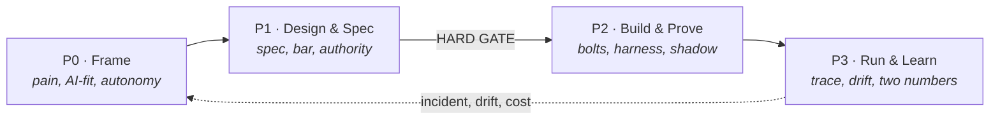
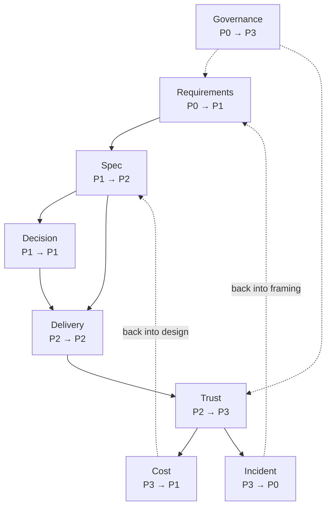
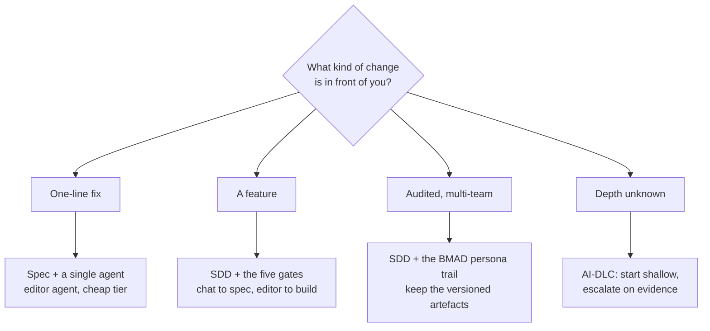

# The agentic PDLC

Four phases and eight loops. This is the spine every other page on this wiki hangs from, and the
structure the [SkyWays playbook](https://akash-coded.github.io/aws-bedrock-agentcore-strands/) walks
through with one airline, one feature and ninety days.

> **The one-sentence version.** Frame what is worth doing, specify it so a machine can build it, build
> and prove it in slices, then run it and let what you learn become the next frame.

---

## The four phases

| | Phase | The question it answers | Who is accountable | It ends when |
| --- | --- | --- | --- | --- |
| **P0** | **Frame** | Is this worth doing, is it AI at all, and how much may the machine do? | Product manager | The pain is a measurement and the AI-fit verdict is recorded |
| **P1** | **Design & Spec** | What exactly is being built, and under whose authority? | Solution architect | The spec, the bar and the guardrails are signed |
| **P2** | **Build & Prove** | Does it meet the bar, slice by slice? | Engineering lead | The golden set clears the bar and a shadow run agrees |
| **P3** | **Run & Learn** | Is it still doing what we launched, and what did it cost? | Sponsor | Two numbers are reported and the next P0 brief exists |

P0 and P1 are cheap to get wrong on paper and expensive to get wrong in production. That asymmetry is
the whole argument for the phases.

The dotted line is the point. P3 is not the end of a line, it is the input to the next P0.

---

## What crosses each hand-off

A phase does not end on a date. It ends when it has handed over what the next phase cannot start
without. Four hand-offs, four minimum sets.

| Hand-off | What must cross | Gate |
| --- | --- | --- |
| P0 → P1 | Pain register, functional requirements, constraints by type, ratified NFRs | soft |
| P1 → P2 | The eight-field spec, the acceptance bar per slice, the authority budget and gate map | **hard** |
| P2 → P3 | Golden set at bar with its lower bound, the shadow-run comparison | soft |
| P3 → P0 | Two-number report, drift readout, the incident turned into a brief | soft |

Only one of the four is a hard gate. Everything downstream is built and measured against the spec, the
bar and the guardrails, so those three are settled before P2 opens. The full list lives on
[The Evidence Pack](The-Evidence-Pack).

---

## The eight loops

Phases are a line. Loops are what make the line a ring: each one opens in one phase and closes in a
later one, and some close back into an earlier one.

Three of them run backwards, and those are the ones teams forget to build:

- **Cost** closes from P3 back into P1. A bill that left its estimate is a design question, not a
  finance question.
- **Incident** closes from P3 back into P0. A postmortem that does not produce a brief has not finished.
- **Governance** spans P0 to P3 and belongs to the sponsor, not to any delivery role.

Each loop, with its owner, its artefacts and where the idea comes from, is on
[The Eight Loops](The-Eight-Loops).

---

## What is genuinely new, and what is not

Most of this is the discipline you already have. The honest list of what actually changes:

| Unchanged | Changed by putting a model in the middle |
| --- | --- |
| Discovery, stakeholder interviews, the pain behind the ask | The pain must be a measurement, because the machine downstream cannot ask what you meant |
| Prioritisation and the business case | Value is counted net of tokens, the judge and the review load |
| A PRD with problem, users, scope, metrics | Eight fields a coding agent reads, acceptance in EARS, a bar per slice |
| Sprints, milestones, dependencies | Bolts: one risk each, the walking skeleton first, the shadow run as the milestone |
| Unit, integration and end-to-end tests | Exact work tested exactly, best-guess work measured as a share, a harness that gates the merge |
| Code review | Depth set by the risk of the action, never by the size of the diff |
| Threat modelling | One genuinely new threat: every text the agent reads is a possible instruction |
| Postmortems | The question is which enforced control was missing, never who was careless |

The role pages carry this split in full:
[Product manager](Role-Product-Manager) ·
[Solution architect](Role-Solution-Architect) ·
[Engineering lead](Role-Engineering-Lead) ·
[QA lead](Role-QA-Lead) ·
[Sponsor](Role-Sponsor).

---

## How the named methods sit on the spine

Four methods get mentioned in every agentic conversation. They are not competitors; they occupy
different parts of the same spine.

| Method | What it is | Where it sits | When to use it |
| --- | --- | --- | --- |
| **SDD** — spec-driven development | The spec, not the code, is what you maintain | P1 and P2, lightly in P0 and P3 | **Always.** It is the backbone |
| **BMAD** — Breakthrough Method for Agile AI-Driven Development | A pipeline of AI personas, each handing a versioned artefact on | P0 to P2 | Complex, multi-team, audited work. Heavy on a one-line change |
| **AI-DLC** — AI-Driven Development Life Cycle (AWS) | Run only the stages a given change actually needs | A principle across all four phases | When the depth of a change is unknown up front |
| **AiDD** — AI-driven development | The day-to-day craft: context files, story files, editor agents, review by risk | P2 mostly | Every day, by everyone who writes code |

The decision that matters is not which method. It is **how deep to go on this change**, and that is a
judgement the architect makes per change. See [Solution architect, step 3](Role-Solution-Architect).

---

## Try it

Take one feature your team is working on right now.

1. Write which phase it is genuinely in. Not which sprint, which **phase**.
2. Write the hand-off it most recently crossed, and name the artefacts that actually crossed with it.
3. If the P1 → P2 hand-off happened without a signed spec, a bar per slice and an authority budget,
   you crossed the one hard gate on credit. Write down what you owe.

What most teams find

The spec exists in some form. The **bar per slice** and the **authority budget** usually do not, which
is why the two most common production surprises are "it is right about 80% of the time and nobody
agreed that was enough" and "nobody decided what it was allowed to do". Both are P1 artefacts missing
from a P2 build.

---

## Where this comes from

Stage-gate systems come from Cooper (1990); the phase names here are the playbook's own. The eight-loop
ring, the hard and soft split, and the minimum artefact set are **working methods** — constructions of
this playbook, offered as defaults to tune, not as standards. Full lineage on
[Sources and Confidence](Sources-and-Confidence).

---

**Next:** [The Eight Loops](The-Eight-Loops) · [Gates and Governance](Gates-and-Governance) ·
[The Evidence Pack](The-Evidence-Pack) · [Playbook Glossary](Playbook-Glossary)
