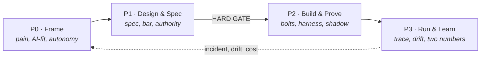
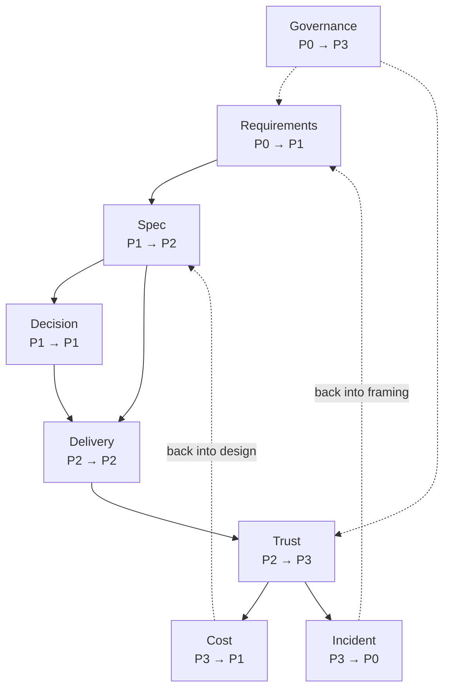
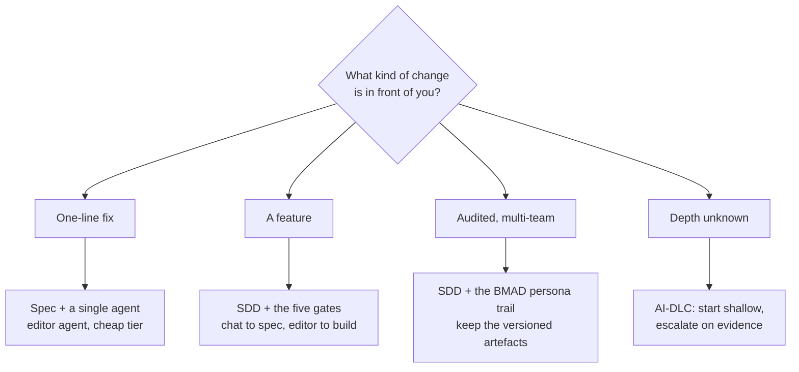

# The agentic PDLC

Four phases and eight loops. This is the spine every other page on this wiki hangs from, and the
structure the [SkyWays playbook](https://akash-coded.github.io/aws-bedrock-agentcore-strands/) walks
through with one airline, one feature and ninety days.

> **The one-sentence version.** Frame what is worth doing, specify it so a machine can build it, build
> and prove it in slices, then run it and let what you learn become the next frame.

---

## The four phases

| | Phase | The question it answers | Who is accountable | It ends when |
| --- | --- | --- | --- | --- |
| **P0** | **Frame** | Is this worth doing, is it AI at all, and how much may the machine do? | Product manager | The pain is a measurement and the AI-fit verdict is recorded |
| **P1** | **Design & Spec** | What exactly is being built, and under whose authority? | Solution architect | The spec, the bar and the guardrails are signed |
| **P2** | **Build & Prove** | Does it meet the bar, slice by slice? | Engineering lead | The golden set clears the bar and a shadow run agrees |
| **P3** | **Run & Learn** | Is it still doing what we launched, and what did it cost? | Sponsor | Two numbers are reported and the next P0 brief exists |

P0 and P1 are cheap to get wrong on paper and expensive to get wrong in production. That asymmetry is
the whole argument for the phases.



The dotted line is the point. P3 is not the end of a line, it is the input to the next P0.

### How it actually goes wrong

Nobody announces that they are skipping P0. What happens is that all four phases run at once and the
team calls it speed: a spike starts on Monday, the spec is written around the spike on Thursday, and
the first genuine decision about what the machine may do is taken by whoever wires the tool. The
phases are then reconstructed backwards from the code, which is why the artefacts read like
descriptions rather than instructions. SkyWays settled the $400 refund cap on day six, in P0, and
nobody noticed it had never left the document until day 82, when $2,000 went out that was not owed.

The second failure is subtler and more common: a phase is declared finished on a date rather than on
an end condition. "P1 closes Friday" is a calendar entry. "P1 closes when the bar per slice is signed"
is a phase. The first always closes; the second sometimes tells you something you did not want to
hear, which is the only reason to have it.

### What good looks like

| Phase | The sign it genuinely closed | The sign it was faked |
| --- | --- | --- |
| **P0** | The pain is one line with a count, a cost and a link to the evidence a sceptic can open | The pain is a sentence from the request email, reworded |
| **P0** | The AI-fit verdict names what was rejected and why | The verdict is "yes, agentic" with no alternative considered |
| **P1** | Someone who was not in the room built the first bolt without asking a question | Every engineer asks the same three questions in week one |
| **P1** | Each acceptance bar has a derivation, not a round number | Every bar is 80% |
| **P2** | A slice below its bar blocks the merge, and somebody has watched it do so | The harness exists and has never gone red |
| **P2** | The shadow run disagreed with the desk somewhere, and that was written down | The shadow run agreed everywhere, and nobody found that odd |
| **P3** | Both numbers reached the sponsor on one line | The saving reached the sponsor; the spend reached finance |
| **P3** | A brief for the next P0 exists with a named owner | The retro produced actions, none of which is a brief |

The phases are per change, not per programme. A one-line fix to a refund cap runs all four in an
afternoon: it is still framed, still specified, still proven, still watched. What varies is the depth,
and that is decided in [How the named methods sit on the spine](#how-the-named-methods-sit-on-the-spine).

<details><summary><b>Template · Phase-exit checklist</b></summary>

```markdown
# Phase exit · <P0|P1|P2|P3> · <feature>
Accountable: <name, role>   Date proposed: <date>   Decision: <exit | stay open | exit with debt>

## The end condition for this phase, written before we started
<the one sentence from the phase table — copied, not paraphrased>

## Is it met?
| Evidence | Where it lives | Current? | Read by |
|----------|----------------|----------|---------|
| <pain register / spec / bar sheet / golden score / two-number report> | <link> | <yes/no, last touched <date>> | <name> |
| | | | |

## What the next phase cannot start without
| Artefact | Owner | State | If missing, what the next phase does instead |
|----------|-------|-------|----------------------------------------------|
| <artefact> | <name> | <done / draft / absent> | <the workaround, and what it will cost> |

## Exit with debt — only if this table is filled in
| What we are crossing without | Why now and not later | Owner | Date it is repaid | What breaks if it is not |
|------------------------------|------------------------|-------|-------------------|--------------------------|
| <artefact> | <reason> | <name> | <date> | <consequence, concretely> |

## Questions the next phase's owner asked in the handover meeting
<every one. Each is a field the phase did not finish.>

## Signed
<name, role> — <date>. Next phase owner: <name>, who has read the above.
```
</details>

<details><summary><b>Prompt · Which phase is this actually in</b></summary>

```text
You are auditing where a piece of work genuinely sits in a four-phase lifecycle.

The phases and their END CONDITIONS:
P0 Frame — ends when the pain is a measurement and the AI-fit verdict is recorded.
P1 Design & Spec — ends when the spec, the acceptance bar per slice and the guardrails are signed.
P2 Build & Prove — ends when the golden set clears the bar and a shadow run agrees.
P3 Run & Learn — ends when two numbers are reported and the next P0 brief exists.

Below is what I can actually show you about the work.

Produce:
1. | Phase | End condition | Met / partly / not met | The single artefact that decides it |
2. The EARLIEST phase whose end condition is not met. That is the phase the work is in,
   regardless of what the board says.
3. Everything that has been built ahead of that phase, and what it is therefore built on.
4. The cheapest thing to do next to close the earliest open phase.

RULES:
- Judge only on artefacts I have shown you. A meeting is not an artefact.
- "We discussed it" is not met. "It is in the prompt" is not signed.
- Do not be encouraging. Do not suggest a process improvement. Answer the question.
- If two phases are open, say so plainly and name the earlier one.

WHAT EXISTS:
<paste: links, contents, or an honest list of what is written down>
```
</details>

---

## What crosses each hand-off

A phase does not end on a date. It ends when it has handed over what the next phase cannot start
without. Four hand-offs, four minimum sets.

| Hand-off | What must cross | Gate |
| --- | --- | --- |
| P0 → P1 | Pain register, functional requirements, constraints by type, ratified NFRs | soft |
| P1 → P2 | The eight-field spec, the acceptance bar per slice, the authority budget and gate map | **hard** |
| P2 → P3 | Golden set at bar with its lower bound, the shadow-run comparison | soft |
| P3 → P0 | Two-number report, drift readout, the incident turned into a brief | soft |

Only one of the four is a hard gate. Everything downstream is built and measured against the spec, the
bar and the guardrails, so those three are settled before P2 opens. The full list lives on
[The Evidence Pack](The-Evidence-Pack).

### How it actually goes wrong

A hand-off degrades into a meeting. The receiving phase's owner sits through forty minutes of context,
says yes, and then spends the next fortnight asking the questions the meeting did not answer — each
one a field the previous phase left open, each one now answered by whoever is nearest rather than by
whoever is accountable. The artefacts exist in some form, but they are scattered across a wiki, a
Slack thread and somebody's laptop, so nobody can say what actually crossed.

The tell is easy to spot and nobody looks for it: **count the questions the receiving owner asks in
the first week.** Zero means the pack was complete. Fifteen means the hand-off was a conversation, and
the answers to those fifteen are now in fifteen places.

### What good looks like

| Sign | Why it matters |
| --- | --- |
| The hand-off has a **record**, not minutes | A record names artefacts and states; minutes name opinions |
| Every artefact on it has **one** accountable name | Two names is nobody |
| The receiving owner has **read** it before the meeting, and the meeting is short | A hand-off meeting that runs long is a hand-off that was not ready |
| Anything crossing incomplete is on a **debt line** with a date | Undeclared debt is discovered in P2, at the worst price |
| Questions asked in week one are **logged back** onto the record | It is the only honest measure of hand-off quality you will get |

<details><summary><b>Template · Hand-off record</b></summary>

```markdown
# Hand-off · <P0→P1 | P1→P2 | P2→P3 | P3→P0> · <feature>
Date: <date>   Gate: <soft | HARD>
Handing over: <name, role>   Receiving: <name, role>   Both present: <yes/no>

## The minimum set for this hand-off
| # | Artefact | Owner | State | Link | Version / date | Receiver has read it |
|---|----------|-------|-------|------|----------------|----------------------|
| 1 | <artefact> | <name> | complete / partial / absent | <link> | <v2, 12 Mar> | yes / no |
| 2 | | | | | | |

## Crossing incomplete — the debt
| Artefact | What is missing | Why we are crossing anyway | Owner | Due | What is blocked until then |
|----------|-----------------|-----------------------------|-------|-----|----------------------------|
| <artefact> | <the specific gap> | <reason> | <name> | <date> | <the bolt / the slice / the gate> |

## Numbers that cross with it
| Number | Value | Where it came from | Who owns it downstream |
|--------|-------|--------------------|------------------------|
| <cases per day> | <240> | <Q2 ticket export> | <name> |
| <refund cap> | <$400> | <constraint register, day 6, regulatory> | <name> |

## Decisions the receiving phase may NOT re-open
<list them, with the record each was taken in. Everything not listed here is open.>

## Questions asked in week one — filled in AFTER the hand-off
| # | Question | Asked by | Which artefact should have answered it |
|---|----------|----------|----------------------------------------|
| 1 | | | |

## Accepted
<receiving owner's name> — <date>. Accepted with <n> debt lines above.
```
</details>

### The one hard hand-off — P1 → P2

Three artefacts make this the only gate that halts: the **eight-field spec**, the **acceptance bar per
slice** and the **authority budget with its gate map**. They are hard for one reason each.

| Artefact | Why nothing downstream survives without it | What P2 does if it is absent |
| --- | --- | --- |
| The spec | It is what the coding agent reads. A machine cannot ask what you meant | The agent invents an interpretation, consistently, and it is plausible |
| The bar per slice | "It works" is no longer a yes or a no, so somebody has to say what share is enough | The team ships at whatever number they got, and calls it the bar |
| The authority budget | It is the list of what the machine may do, with caps typed into signatures | The tool signature accepts any amount, and the cap lives in the prompt |

SkyWays crossed this gate with all three written and the third only partly implemented. The cap was in
the autonomy record from day 12 and repeated clearly in the system prompt. It was not in the refund
tool's signature. On day 82 the agent issued $2,000 within its permissions and outside its policy. The
hand-off record would have caught it with one column: **implemented, or written down?**

Cross it on credit if you must — some programmes genuinely cannot wait — but write the waiver, because
an undeclared crossing is indistinguishable from a completed one six weeks later.

<details><summary><b>Template · Hard-gate waiver · P1 → P2</b></summary>

```markdown
# Hard-gate waiver · P1 → P2 · <feature>
This document exists because the hard gate was crossed without its full set.
Raised by: <name>   Approved by: <sponsor name>   Date: <date>   Expires: <date>

## What is missing
| Artefact | Missing entirely, or written but not enforced? | Where the real control currently lives |
|----------|-----------------------------------------------|-----------------------------------------|
| <authority budget> | written, NOT enforced | <the system prompt — which is not a control> |

## Why we are crossing now
<the business reason, in two sentences, with the date it is tied to>

## The blast radius while the waiver stands
| Action the agent can take | Band | Cap enforced in code? | Approver enforced? | Worst single outcome |
|---------------------------|------|-----------------------|--------------------|----------------------|
| <refund> | R4 | no | no | <an unowed payment of unbounded size> |
| <rebook> | R4 | yes | yes | <a wrong itinerary, recoverable> |

## What we are doing instead, until it is closed
| Compensating control | Who operates it | How often | Is it enforced or is it a habit? |
|----------------------|-----------------|-----------|----------------------------------|
| <daily manual review of all refunds> | <name> | daily | habit |

## Closure
| The artefact, completed | Owner | Due | Evidence it is enforced, not written |
|-------------------------|-------|-----|--------------------------------------|
| <typed cap on the tool signature + test> | <name> | <date> | <the failing test, linked> |

## Review
This waiver is read aloud at the <weekly> delivery meeting until it is closed.
If it passes its expiry date, the feature returns to <the lower autonomy level>.

Signed: <sponsor>, <date>.
```
</details>

<details><summary><b>Prompt · Audit a hand-off against its minimum set</b></summary>

```text
You are checking whether a phase hand-off is complete. Be strict and unhelpful about gaps.

The minimum set for <P0→P1 | P1→P2 | P2→P3 | P3→P0> is:
<paste the rows from The Evidence Pack for this hand-off>

Below is what the team says it has.

Produce:
1. | Artefact | Claimed state | Evidence I can actually see | Verdict: COMPLETE / PARTIAL / ABSENT / WRITTEN-BUT-NOT-ENFORCED |
2. A separate list: every artefact that is WRITTEN-BUT-NOT-ENFORCED. For each, name the place
   the control currently lives (a prompt, a document, a convention) and the place it must live
   (a tool signature, a policy, a required check).
3. The three gaps that would cost the most if this hand-off is the HARD one, ranked by the
   worst single outcome, not by effort.
4. For each of those three: the smallest artefact that closes it, and who owns it.

RULES:
- A control described in a prompt is NOT enforced. Say so every time, without softening it.
- Do not accept "we agreed that" as evidence. Ask which document.
- Do not propose a process. Propose artefacts.
- If you cannot tell from what I gave you, write CANNOT TELL and the one question that settles it.

WHAT THE TEAM HAS:
<paste>
```
</details>

### The hand-off nobody schedules — P3 → P0

The other three hand-offs have a receiving owner sitting in a meeting. This one does not, because P0
for the next thing has not started, so there is nobody on the far side. That is why it is the hand-off
most often missing entirely: the two-number report goes to the steering committee, the drift chart
goes on a wall, the postmortem produces actions, and none of the three becomes a brief.

A postmortem that does not produce a brief has not finished. SkyWays' day 82 incident produced a typed
cap, a confirmation token, refunds dropped one autonomy level and six new golden cases — and that list
*is* the next P0 brief, once somebody writes it as one.

<details><summary><b>Prompt · Turn a P3 readout into the next P0 brief</b></summary>

```text
Below are the P3 outputs for <feature>: the two-number report, the drift readout, and the
postmortem or bill root-cause note.

Write the P0 brief for the next cycle. A P0 brief has exactly four parts:
- THE PAIN: who holds it, how often, what it costs today, and the evidence.
- THE AI-FIT QUESTION: is there judgement, is there volume, is it recoverable?
- THE VALUE LINE: the saving, minus run cost and review load.
- THE AUTONOMY QUESTION: which action, which door, one-way or two-way.

RULES:
- Every number must come from the material below. If a number is not there, write
  "UNKNOWN — <who can produce it> by <when>" instead of estimating. Never estimate.
- A missing enforced control from a postmortem is a PAIN, not an action item. Write it as one:
  who is exposed, how often the path is open, what one instance costs.
- Do not carry over the previous cycle's framing. If the evidence says the problem moved,
  say the problem moved.
- End with: the ONE thing that, if it came back badly, would mean not doing this at all.

P3 MATERIAL:
<paste>
```
</details>

---

## The eight loops

Phases are a line. Loops are what make the line a ring: each one opens in one phase and closes in a
later one, and some close back into an earlier one.



Three of them run backwards, and those are the ones teams forget to build:

- **Cost** closes from P3 back into P1. A bill that left its estimate is a design question, not a
  finance question.
- **Incident** closes from P3 back into P0. A postmortem that does not produce a brief has not finished.
- **Governance** spans P0 to P3 and belongs to the sponsor, not to any delivery role.

Each loop, with its owner, its artefacts and where the idea comes from, is on
[The Eight Loops](The-Eight-Loops).

### How it actually goes wrong

The five forward loops close on their own, because somebody downstream is waiting and will chase. The
three that run backwards have nobody waiting, so they close only if a named person makes them close.
What happens instead is that the cost loop becomes a finance escalation — a spend review, a budget
increase, a conversation about tooling — and never reaches the design that caused it. SkyWays' day 75
bill was 4.4 times its estimate with traffic flat, which is a behaviour change, which is a design
change. Handled as a budget question it recurs next quarter with a different multiple.

### What good looks like

| Loop | Closed looks like | Open looks like |
| --- | --- | --- |
| **Cost** | A bill anomaly produced an amended decision record and a routing change | A bill anomaly produced an approved budget increase |
| **Incident** | A postmortem produced a brief with a pain, a cost and an owner | A postmortem produced a list of actions in a ticket tracker |
| **Governance** | One person reports two numbers on one line, every cycle, unprompted | Numbers are produced when the steering committee asks |

A practical test: for each of the three backwards loops, name the person. Not the team, the person. If
you cannot, the loop is absent, and absent is the honest word — not "informal".

---

## What is genuinely new, and what is not

Most of this is the discipline you already have. The honest list of what actually changes:

| Unchanged | Changed by putting a model in the middle |
| --- | --- |
| Discovery, stakeholder interviews, the pain behind the ask | The pain must be a measurement, because the machine downstream cannot ask what you meant |
| Prioritisation and the business case | Value is counted net of tokens, the judge and the review load |
| A PRD with problem, users, scope, metrics | Eight fields a coding agent reads, acceptance in EARS, a bar per slice |
| Sprints, milestones, dependencies | Bolts: one risk each, the walking skeleton first, the shadow run as the milestone |
| Unit, integration and end-to-end tests | Exact work tested exactly, best-guess work measured as a share, a harness that gates the merge |
| Code review | Depth set by the risk of the change, never by the size of the diff |
| Threat modelling | One genuinely new threat: every text the agent reads is a possible instruction |
| Postmortems | The question is which enforced control was missing, never who was careless |

The role pages carry this split in full:
[Product manager](Role-Product-Manager) ·
[Solution architect](Role-Solution-Architect) ·
[Engineering lead](Role-Engineering-Lead) ·
[QA lead](Role-QA-Lead) ·
[Sponsor](Role-Sponsor).

The same split, told as a working week rather than as a role, is in the five journeys:
[Journey: Product manager](Journey-Product-Manager) ·
[Journey: Solution architect](Journey-Solution-Architect) ·
[Journey: Engineering lead](Journey-Engineering-Lead) ·
[Journey: QA lead](Journey-QA-Lead) ·
[Journey: DevOps](Journey-DevOps).

### How it actually goes wrong

Two opposite mistakes, and a team usually makes one of them consistently. The first is treating the
whole column on the right as new, which produces a parallel process: an AI working group, an AI
review board, an AI intake form, and a delivery team that now has two lifecycles and uses whichever is
less trouble. The second is treating none of it as new, which produces a PRD handed to a coding agent
that builds something plausible and wrong, and a test suite that asserts equality on an output that is
right 80% of the time.

The expensive one is the second, because it is invisible until the shadow run. The suite is green, the
demo works, and nobody has agreed what share of cases being right is enough — so the first person to
ask is a passenger.

### What good looks like

| Sign | What it tells you |
| --- | --- |
| The team's existing ceremonies are unchanged in name and cadence | Nobody is running a second lifecycle |
| The PRD template gained fields; it was not replaced | The change landed in the artefact, not in a new process |
| Somebody can point at a test that measures a **share** rather than asserting equality | The exact/best-guess split has actually been made |
| A pull request was reviewed deeply because of what it touches, not how big it is | Review by risk band is real, not aspirational |
| The phrase "the model decided" appears nowhere in a postmortem | The missing-control question has replaced the blame question |

<details><summary><b>Template · The practice delta</b></summary>

```markdown
# Practice delta · <team> · <date>
What we already do, what changes, and what we are NOT adding. One page, reviewed each quarter.

## Unchanged — we keep these exactly as they are
| Our existing practice | Where it lives | Why it survives a model in the middle |
|-----------------------|----------------|----------------------------------------|
| <sprint planning, Tue 10:00> | <board> | <cadence is unaffected; only the unit of work changes> |

## Changed — same ceremony, different content
| Practice | What we did before | What it produces now | Who changed it | Since |
|----------|--------------------|-----------------------|----------------|-------|
| <definition of done> | <"tests pass"> | <"tests pass AND the slice is at or above its bar, lower bound"> | <QA lead> | <date> |
| <code review> | <every PR, one approver> | <depth by risk band from a path rule; R4 needs a named approver> | <eng lead> | <date> |

## Added — genuinely new artefacts, with an owner each
| Artefact | Owner | Replaces nothing / replaces <x> | First one due |
|----------|-------|----------------------------------|---------------|
| <acceptance bar sheet> | <PM> | replaces nothing | <date> |
| <authority budget> | <architect> | replaces nothing | <date> |

## NOT adding — and why, so it is not re-proposed each quarter
| Proposed | Why not, for us, now |
|----------|----------------------|
| <a separate AI review board> | <it creates a second lifecycle; the five gates already have owners> |

## The one thing we are worst at
<name it. It is usually the bar per slice or the authority budget.>
Owner: <name>   Due: <date>
```
</details>

---

## How the named methods sit on the spine

Four methods get mentioned in every agentic conversation. They are not competitors; they occupy
different parts of the same spine.

| Method | What it is | Where it sits | When to use it |
| --- | --- | --- | --- |
| **SDD** — spec-driven development | The spec, not the code, is what you maintain | P1 and P2, lightly in P0 and P3 | **Always.** It is the backbone |
| **BMAD** — Breakthrough Method for Agile AI-Driven Development | A pipeline of AI personas, each handing a versioned artefact on | P0 to P2 | Complex, multi-team, audited work. Heavy on a one-line change |
| **AI-DLC** — AI-Driven Development Life Cycle (AWS) | Run only the stages a given change actually needs | A principle across all four phases | When the depth of a change is unknown up front |
| **AiDD** — AI-driven development | The day-to-day craft: context files, story files, editor agents, review by risk | P2 mostly | Every day, by everyone who writes code |

The decision that matters is not which method. It is **how deep to go on this change**, and that is a
judgement the architect makes per change. See [Solution architect, step 3](Role-Solution-Architect).



### How it actually goes wrong

A team adopts one method as an identity. "We are a BMAD shop" means the persona trail runs on a
typo fix, six artefacts are generated for a one-line change, and within a month the team is quietly
skipping the whole thing on everything — including the audited, multi-team work the trail was built
for. The opposite failure is the same mistake upside down: "we just use the editor agent", applied to
a refund cap, which is R4 work being done with R1 ceremony.

Depth is a property of the change, not of the team. A one-line change to a refund cap is tiny and
deep. A 900-line refactor of a read-only report is large and shallow. Anything that sizes ceremony to
diff will get both of those backwards.

### What good looks like

| Sign | Why it matters |
| --- | --- |
| Two changes in the same sprint ran at **different depths**, on purpose | Depth is being decided, not defaulted |
| The depth decision is written down in one place, in under ten lines | A depth decision that takes an hour is its own overhead |
| SDD is on **every** change, however shallow | The spec is the only artefact that survives the code |
| A change escalated mid-flight, and that was normal rather than a failure | AI-DLC's actual content: evidence raises depth |
| Nobody has said the words "our methodology" this quarter | Methods are tools here, not an identity |

<details><summary><b>Template · Method-depth decision</b></summary>

```markdown
# Depth decision · <change name> · <date>
Decided by: <architect name>. Ten lines or fewer. If it takes longer, the change needs splitting.

## The change, in one sentence
<what is being changed, and what it touches>

## The four questions
| Question | Answer | Consequence |
|----------|--------|-------------|
| Highest risk band any tool or path it touches? | <R1–R5> | <R4+ means a named approver and deep review, whatever the size> |
| Reversible cheaply once live? | <yes/no> | <no means the plan gate is hard for this change> |
| More than one team's artefacts change? | <yes/no> | <yes pulls in the BMAD persona trail and versioned hand-offs> |
| Is an auditor or a regulator a reader of the result? | <yes/no> | <yes means the trail is kept, not just the outcome> |

## Depth chosen
<Shallow: spec + single agent | Standard: SDD + five gates | Deep: SDD + persona trail + kept artefacts>

## What we are deliberately NOT doing at this depth
| Skipped | Why it is safe to skip here |
|---------|------------------------------|
| <shadow run> | <read-only path, no action taken, rollback is a flag> |

## Escalation trigger — the evidence that raises the depth mid-flight
| If this happens | Depth becomes | Who decides |
|-----------------|---------------|-------------|
| <the change turns out to touch a gated write> | Deep | <architect> |
| <the golden set moves more than <n> points on an untouched slice> | Standard | <QA lead> |

## SDD applies regardless
Spec updated: <yes — link>. A change with no spec change is a change nobody can review.
```
</details>

<details><summary><b>Prompt · Recommend the depth for this change</b></summary>

```text
You are helping decide how much process a single change deserves. You are NOT deciding whether
to do it.

Depths available:
- SHALLOW: spec update + one editor agent, cheap tier, review at the end.
- STANDARD: spec-driven, the five gates, chat model for the spec and editor agent for the build.
- DEEP: spec-driven plus a versioned persona trail, artefacts kept for audit, named approver.

Below is the change.

Produce:
1. The highest risk band the change touches (R1 reversible draft ... R5 irreversible or
   safety-critical), and WHICH tool or path puts it there.
2. Answers to: reversible cheaply once live? more than one team's artefacts? an auditor reads
   the result?
3. A recommended depth, in one word, with a one-sentence reason.
4. The two ceremonies you would skip at that depth, and the specific reason each is safe to skip.
5. One escalation trigger: the concrete evidence that should raise the depth mid-flight.

RULES:
- Never use the size of the diff as a reason. A one-line change to a money cap is the deepest
  work there is; a large refactor of a read-only report is not.
- If the change touches money, identity or policy, the answer is at least STANDARD and you must
  say why explicitly.
- Recommend SDD on every depth, including SHALLOW. Do not offer "no spec" as an option.
- Keep the whole answer under 200 words.

THE CHANGE:
<paste: what it touches, which tools, which paths, who reads the result>
```
</details>

---

## Where a model helps across this page

| Tool | Use it for |
| --- | --- |
| **Chat LLM** | The phase-placement audit. Paste what exists, ask which end condition is unmet first. It is good at being literal about evidence, which is exactly the discipline that slips |
| **Chat LLM** | Drafting the hand-off record from the artefacts you already have, then listing what is on neither the record nor the disk |
| **Claude Code** | Checking the claim behind the hard gate: grep the tool signatures for the cap, the policy for the approver, and the CI config for the required check. A control it cannot find in code is not enforced |
| **Chat LLM, adversarially** | "Read this waiver as the sponsor who will be asked about it after an incident. What does it not say?" Cheap, and it finds the missing blast-radius row |
| **Do not delegate** | Declaring a phase closed. The model can tell you the end condition is unmet; only a named person can decide to cross anyway, and that decision is the job |

---

## Try it

Take one feature your team is working on right now.

1. Write which phase it is genuinely in. Not which sprint, which **phase**.
2. Write the hand-off it most recently crossed, and name the artefacts that actually crossed with it.
3. If the P1 → P2 hand-off happened without a signed spec, a bar per slice and an authority budget,
   you crossed the one hard gate on credit. Write down what you owe.
4. For each of the three artefacts, add one column: **enforced, or written down?** A cap in a prompt
   goes in the second column.
5. Name the person — not the team — who closes the cost loop and the incident loop. If you cannot
   name them, write *absent* rather than *informal*.

<details>
<summary>What most teams find</summary>

The spec exists in some form. The **bar per slice** and the **authority budget** usually do not, which
is why the two most common production surprises are "it is right about 80% of the time and nobody
agreed that was enough" and "nobody decided what it was allowed to do". Both are P1 artefacts missing
from a P2 build.

The fourth question is the one that changes the conversation. Most teams can produce all three
artefacts and then discover, in the second column, that one of them describes a control nobody
implemented. That is not a documentation gap; it is the day 82 incident with the date not yet filled
in.
</details>

<details>
<summary>Try it · the harder version, for a team that passed the first</summary>

Run the phase-exit checklist backwards on something already in production.

1. Take a feature you shipped three months ago and write its P1 exit as if you were signing it today.
2. For each artefact, find the current version. Not the version that crossed — the current one.
3. Count how many have been changed since launch without the spec being changed with them.

The count is your drift between what the system does and what the pack says it does. Anything above
zero means the pack has become a historical document, and its next reader — an auditor, a new
engineer, or you in six months — will be misled by it rather than helped.
</details>

---

## Where this comes from

Stage-gate systems come from Cooper (1990); the phase names here are the playbook's own. The eight-loop
ring, the hard and soft split, and the minimum artefact set are **working methods** — constructions of
this playbook, offered as defaults to tune, not as standards. Full lineage on
[Sources and Confidence](Sources-and-Confidence).

---

**Next:** [The Eight Loops](The-Eight-Loops) · [Gates and Governance](Gates-and-Governance) ·
[The Evidence Pack](The-Evidence-Pack) · [Playbook Glossary](Playbook-Glossary) ·
[Journey: Product manager](Journey-Product-Manager) ·
[Journey: Solution architect](Journey-Solution-Architect)
