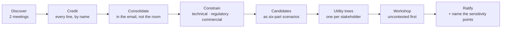
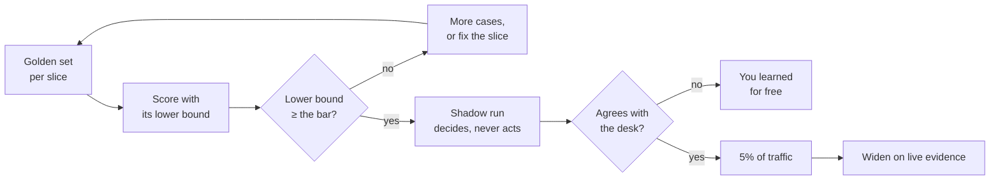

# The eight loops

Four phases are a line. Eight loops are what make it a ring. Each loop **opens** in one phase, **closes**
in another, and has exactly one accountable owner. A programme that runs the phases but not the loops
ships once and then drifts.

Walk them live on the [Loop Map](https://akash-coded.github.io/aws-bedrock-agentcore-strands/#/loopmap).

---

## The eight, at a glance

| Loop | Opens | Closes | Owner | Confidence |
| --- | --- | --- | --- | --- |
| [Requirements](#requirements) | P0 | P1 | Solution architect | working method |
| [Spec](#spec) | P1 | P2 | Product manager | established |
| [Decision](#decision) | P1 | P1 | Solution architect | established |
| [Delivery](#delivery) | P2 | P2 | Engineering lead | working method |
| [Trust](#trust) | P2 | P3 | QA lead | established |
| [Cost](#cost) | P3 | **P1** | Solution architect | documented |
| [Incident](#incident) | P3 | **P0** | Every role | established |
| [Governance](#governance) | P0 | P3 | Sponsor | working method |

The two loops that close backwards — cost into P1, incident into P0 — are the ones that turn a project
into a practice. Most teams have neither.

---

## Requirements

**P0 → P1 · the solution architect**

Two discovery meetings become a credited email of functional requirements, a constraints list sorted by
type, candidate NFRs written as six-part scenarios, a utility tree per stakeholder, a workshop, and a
ratified set with its sensitivity points named.

The move that carries the whole loop: **credit before you consolidate.** Send all thirty-one
requirements with the name of the person who raised each one, duplicates included, *before* you send
the consolidated twelve. Merging in the room leaves two people believing they were dropped, and a
dropped voice comes back in week five as a constraint.

A sensitivity point is an NFR rated high for both importance and difficulty. Those, and only those,
earn a decision record.

**Run it:** [How to Run an NFR Workshop](How-to-Run-an-NFR-Workshop) ·
[simulation](https://akash-coded.github.io/aws-bedrock-agentcore-strands/#/simulations/nfr)

*Lineage: utility trees and sensitivity points from ATAM (Kazman, Klein and Clements, SEI, 2000);
six-part quality attribute scenarios from Bass, Clements and Kazman. The chain is the playbook's.*

---

## Spec

**P1 → P2 · the product manager**

A pain register becomes an eight-field living spec, acceptance criteria in EARS, an acceptance bar per
slice, story files a coding agent can read, and a golden set that proves the bar.

The five fields that are new are the ones nobody had decided:

| Classical (keep) | Agentic (add) |
| --- | --- |
| Title | The model's role |
| Value | Autonomy level |
| Acceptance criteria | The bar, per slice |
| | The fallback |
| | The records it must write |

**The reading test:** hand the eight fields to someone who was not in the room and ask them to build
it. Every question they ask is a field you have not finished.

**Run it:** [Role: Product manager](Role-Product-Manager) ·
[episode](https://akash-coded.github.io/aws-bedrock-agentcore-strands/#/episode/spec1)

*Lineage: EARS (Mavin, Wilkinson, Harwood and Novak, Rolls-Royce, 2009). The eight fields and the bar
per slice are the playbook's.*

---

## Decision

**P1 → P1 · the solution architect**

Tier, family, framework, cloud, memory and security choices get sorted into **hard gates** that halt the
phase and **soft gates** that run alongside the build. Every trade-off point gets a record.

The trap is treating all of them as hard. Eleven open decisions, all hard, and the build waits behind
every one of them. Four questions sort them; see [Gates and Governance](Gates-and-Governance).

The rule for records: **one ADR per trade-off point, and nowhere else.** Forty records in a week means
nobody reads the forty-first, and the three that mattered are buried.

**Run it:** [How to Choose Build, Buy or Borrow](How-to-Choose-Build-Buy-or-Borrow) ·
[episode](https://akash-coded.github.io/aws-bedrock-agentcore-strands/#/episode/adr1)

*Lineage: architecture decision records (Nygard, 2011); ATAM sensitivity and trade-off points; Conway's
law (1968) for the weight given to team skills.*

---

## Delivery

**P2 → P2 · the engineering lead**

The design hands over to a dependency-ordered cut of daily bolts. The harness gates each merge per
slice. Review depth is set by the risk of the change, never by the size of the diff.

A **bolt** is a thin, shippable slice reviewed and integrated the same day. A sprint's five stories
become ten daily bolts: the same ten working days, but evidence every day instead of a demo on day
fourteen, and a wrong turn costs one day instead of two weeks.

Order is the architect's job, cadence is the PM's. The walking skeleton goes first because it proves
the pieces connect; the plug goes in before any gated write that needs it.

**Run it:** [How to Cut Sprints into Bolts](How-to-Cut-Sprints-into-Bolts) ·
[How to Review by Risk Band](How-to-Review-by-Risk-Band)

*Lineage: the walking skeleton (Cockburn, Crystal Clear, 2004); the bolt comes from the AWS
AI-Driven Development Lifecycle. One risk per bolt is the playbook's.*

---

## Trust

**P2 → P3 · the QA lead**

The autonomy record sets the level, the authority budget bounds the tools, a golden set with the right
checker proves the bar, and a shadow run earns a cut-over that starts at five percent of traffic.

Two things people skip. The **lower bound**: a score of 82% on forty cases has not proven an 80% bar.
And **five percent**: cutting over at fifty means half your passengers meet the first-day failure.

**Run it:** [How to Prove the Bar](How-to-Prove-the-Bar) · [Role: QA lead](Role-QA-Lead)

*Lineage: shadow deployment and canary release; LLM-as-a-judge evaluation; one-way and two-way doors
(Bezos, 2015 letter to shareholders).*

---

## Cost

**P3 → P1 · the solution architect**

Quality, cost and latency move together, so each slice chooses its own corner. Caching, routing by
slice and a circuit breaker hold the bill. A blowout is traced to one of four leaks and back to the
decision record that allowed it.

The four signatures in the per-call log:

| Signature | The habit behind it |
| --- | --- |
| Tokens per call rose | Whole documents pasted instead of slices |
| Tier mix moved to frontier | No routing, everything sent to the biggest model |
| Cache hit ratio fell | A model switch mid-task, or a timestamp inside the cached block |
| Retries per conversation rose | Vague asks, or a model too weak for the slice |

It closes into **P1**, not into finance, because the fix is a design change.

**Run it:** [How to Control the Token Bill](How-to-Control-the-Token-Bill)

*Lineage: prompt-caching and batch pricing as documented by Anthropic and Amazon Bedrock, read in
September 2026; a model gateway such as LiteLLM as the named example.*

---

## Incident

**P3 → P0 · every role**

A postmortem names the enforced control that would have made the incident impossible. The finding
becomes a decision record, a lower autonomy level, and the brief for the next P0.

One question runs the whole loop:

> **Which enforced control, if it had been present, would have made this impossible?**

Not who typed it. Not what the passenger sent. A refund of $2,000 that was not owed is not a story
about an injection string; it is a story about a cap and an approver that were both off.

**Run it:** [How to Run a Missing-Control Postmortem](How-to-Run-a-Missing-Control-Postmortem)

*Lineage: blameless postmortems (Beyer and colleagues, Site Reliability Engineering, 2016); least
privilege (Saltzer and Schroeder, 1975); layered defences (Reason, 1990).*

---

## Governance

**P0 → P3 · the sponsor**

A minimum artefact set at each hand-off, hard gates that halt and soft gates that run in parallel, one
accountable name per artefact, and two numbers reported together every cycle.

This is the only loop the delivery roles do not own, and it is the one that decides whether the
programme survives its first token bill. A saving reported without the spend beside it is the number
that gets the programme cancelled later.

**Run it:** [Gates and Governance](Gates-and-Governance) · [Role: Sponsor](Role-Sponsor)

*Lineage: stage-gate systems (Cooper, 1990); paired indicators (Grove, 1983); Goodhart's law (1975).
The hard and soft split and the two-number report are the playbook's.*

---

## Try it

For each of the eight loops, write one of three words against your own programme: **closed**, **open**,
or **absent**.

How to read your answers

- **Requirements, spec, decision, delivery, trust** open or absent → you are building without a
  measurable definition of done. Start at the spec loop; it is the cheapest to close.
- **Cost absent** → your first surprise bill will be handled as a finance escalation rather than a
  design fix, and it will recur.
- **Incident absent** → your postmortems end in a name rather than a control, so the same class of
  incident will return.
- **Governance absent** → nobody owns the pairing of the two numbers, and the programme is one
  steering meeting away from being judged on the number you did not bring.

Most teams close five and are missing cost, incident and governance. Those three are the practice.

---

**Next:** [The Agentic PDLC](The-Agentic-PDLC) · [Gates and Governance](Gates-and-Governance) ·
[Scenario Library](Scenario-Library) · [Sources and Confidence](Sources-and-Confidence)
