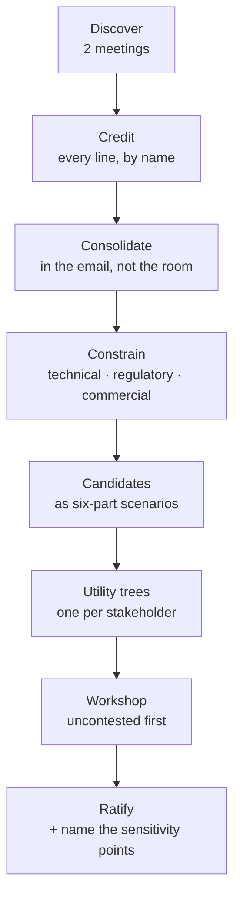
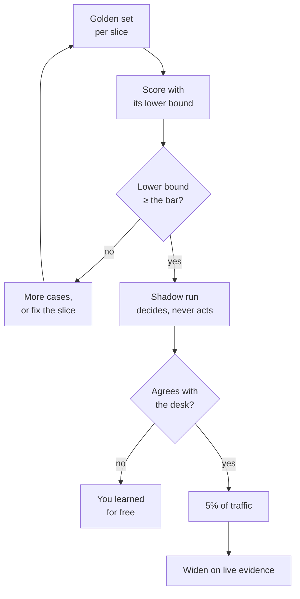

# The eight loops

Four phases are a line. Eight loops are what make it a ring. Each loop **opens** in one phase, **closes**
in another, and has exactly one accountable owner. A programme that runs the phases but not the loops
ships once and then drifts.

Walk them live on the [Loop Map](https://akash-coded.github.io/aws-bedrock-agentcore-strands/#/loopmap).

---

## The eight, at a glance

| Loop | Opens | Closes | Owner | Confidence |
| --- | --- | --- | --- | --- |
| [Requirements](#requirements) | P0 | P1 | Solution architect | working method |
| [Spec](#spec) | P1 | P2 | Product manager | established |
| [Decision](#decision) | P1 | P1 | Solution architect | established |
| [Delivery](#delivery) | P2 | P2 | Engineering lead | working method |
| [Trust](#trust) | P2 | P3 | QA lead | established |
| [Cost](#cost) | P3 | **P1** | Solution architect | documented |
| [Incident](#incident) | P3 | **P0** | Every role | established |
| [Governance](#governance) | P0 | P3 | Sponsor | working method |

The two loops that close backwards — cost into P1, incident into P0 — are the ones that turn a project
into a practice. Most teams have neither.

### What closing a loop actually means

A loop is closed when something learned at the far end has **changed an artefact at the near end**,
and you can point at the change. Not a discussion, not a ticket, not a lesson. An amended document
with a date on it.

| Word | What it means here | The test |
| --- | --- | --- |
| **Closed** | An artefact at the opening phase has been changed by evidence from the closing phase | Show the diff |
| **Open** | The evidence exists and has a named owner, and the artefact has not changed yet | Show the owner and the date |
| **Absent** | Nobody is accountable for the return path | You cannot name a person |

*Informal* is not one of the three. A loop that closes when somebody happens to remember is absent
with better manners.

<details><summary><b>Template · Loop closure record</b></summary>

```markdown
# Loop closure · <requirements | spec | decision | delivery | trust | cost | incident | governance>
Feature: <feature>   Cycle: <n>   Closed on: <date>   Owner: <name, role>

## What was learned, and where
| The evidence | Phase | Date | Link |
|--------------|-------|------|------|
| <the bill was 4.4x its estimate with traffic flat> | P3 | <day 75> | <per-call log> |

## The artefact it changed
| Artefact | Phase it lives in | Before | After | Diff |
|----------|-------------------|--------|-------|------|
| <ADR-001, model tier per slice> | P1 | v1, <date> | v2, <date> | <link> |

## What changed in it, in one sentence
<"classification moves to the cheap tier, the judgement call stays on the capable tier, and
cost per case becomes a monitored number with an alert at 3x">

## What did NOT change, and why
| Considered | Rejected because |
|------------|-------------------|
| <raising the budget> | <traffic was flat, so this is behaviour, not volume> |

## How we will know it closed for good
| Signal | Threshold | Watched where | Owner |
|--------|-----------|---------------|-------|
| <cost per case> | <$0.60, alert at 3x> | <weekly, per-call log> | <name> |

## Time from evidence to closure
Evidence dated <date>. Artefact changed <date>. Elapsed: <n> days.
<Track this number. It degrades long before the verdict does.>
```
</details>

---

## Requirements

**P0 → P1 · the solution architect**

Two discovery meetings become a credited email of functional requirements, a constraints list sorted by
type, candidate NFRs written as six-part scenarios, a utility tree per stakeholder, a workshop, and a
ratified set with its sensitivity points named.



The move that carries the whole loop: **credit before you consolidate.** Send all thirty-one
requirements with the name of the person who raised each one, duplicates included, *before* you send
the consolidated twelve. Merging in the room leaves two people believing they were dropped, and a
dropped voice comes back in week five as a constraint.

A sensitivity point is an NFR rated high for both importance and difficulty. Those, and only those,
earn a decision record.

### How it actually goes wrong

The workshop runs, the set is ratified, and the loop looks closed — but the consolidation happened on
a whiteboard in the room, so two people left believing their line was dropped. Their requirement
returns in week five as a constraint, carrying the authority of someone who was ignored, and it
arrives after the design that would have accommodated it. The other common failure is quieter: the
ratified set is complete on the attributes somebody thought to ask about. Two of SkyWays' nine
candidates — the autonomy level and cost per case at $0.60 — were on the list only because one person
asked what was missing, and both turned out to be sensitivity points.

### What good looks like

| Sign | The test |
| --- | --- |
| Every ratified NFR is a number with a named downstream use | Point at the acceptance bar or the golden-set slice it becomes |
| The constraint register was read **before** any target was set | The workshop opened with constraints as facts, not as proposals |
| Every sensitivity point has an owner and a date for its record | Three names, three dates, on the ratified register |
| Somebody asked "what attribute have we not discussed?" | It is on the agenda, not left to a good day |

**Run it:** [How to Run an NFR Workshop](How-to-Run-an-NFR-Workshop) ·
[Journey: Solution architect](Journey-Solution-Architect) ·
[simulation](https://akash-coded.github.io/aws-bedrock-agentcore-strands/#/simulations/nfr)

*Lineage: utility trees and sensitivity points from ATAM (Kazman, Klein and Clements, SEI, 2000);
six-part quality attribute scenarios from Bass, Clements and Kazman. The chain is the playbook's.*

---

## Spec

**P1 → P2 · the product manager**

A pain register becomes an eight-field living spec, acceptance criteria in EARS, an acceptance bar per
slice, story files a coding agent can read, and a golden set that proves the bar.

The five fields that are new are the ones nobody had decided:

| Classical (keep) | Agentic (add) |
| --- | --- |
| Title | The model's role |
| Value | Autonomy level |
| Acceptance criteria | The bar, per slice |
| | The fallback |
| | The records it must write |

**The reading test:** hand the eight fields to someone who was not in the room and ask them to build
it. Every question they ask is a field you have not finished.

### How it actually goes wrong

The spec is written after the spike and describes what was built, which makes it a very good document
and a useless instruction. The five new fields are then filled with defaults nobody chose — autonomy
*assisted*, bar *80%*, fallback *escalate to a human* — and the page reads complete while deciding
nothing. Eighty percent of what, measured how, and against which slice? Escalate to whom, in what
queue, within how long? The reading test catches all of it in twenty minutes and is skipped precisely
because everyone who could run it was in the room.

### What good looks like

| Sign | The test |
| --- | --- |
| Each bar has a **derivation**, not a round number | "80% because a wrong codeshare option costs $<n> and a caught one saves $<n>" |
| The fallback names a queue, a person and a time | Not "a human reviews it" |
| The records field lists the rows the run must write | An audit question later has a table to look in |
| A non-participant built the first bolt without asking | The reading test was actually run, and by someone outside |

<details><summary><b>Prompt · The reading test, run by a model first</b></summary>

```text
You are an engineer who was NOT in any of the meetings. You have been handed the spec below and
told to build the first slice. You cannot ask anybody anything.

Produce, in this order:
1. Every question you would have to ask before you could start. One line each, most blocking first.
2. For each question, the field of the spec that should have answered it.
3. Every place where you would have to GUESS to proceed, and the guess you would make.
   State each guess as "I would assume <x>" — these are the assumptions that ship.
4. Every instruction that is a preference rather than a testable statement
   ("handle gracefully", "reasonable latency", "as needed").
5. The acceptance criteria in EARS form: WHEN <trigger> THE <system> SHALL <response>.
   Mark any criterion you cannot put in EARS form — nobody can test that one.

RULES:
- Do not be charitable. Do not fill gaps with convention; report them as gaps.
- Do not propose an implementation. You are testing the document.
- Flag any number with no unit, population or measurement window.
- End with one sentence: could you build the first slice from this, yes or no?

SPEC:
<paste all eight fields>
```
</details>

**Run it:** [Role: Product manager](Role-Product-Manager) ·
[Journey: Product manager](Journey-Product-Manager) ·
[episode](https://akash-coded.github.io/aws-bedrock-agentcore-strands/#/episode/spec1)

*Lineage: EARS (Mavin, Wilkinson, Harwood and Novak, Rolls-Royce, 2009). The eight fields and the bar
per slice are the playbook's.*

---

## Decision

**P1 → P1 · the solution architect**

Tier, family, framework, cloud, memory and security choices get sorted into **hard gates** that halt the
phase and **soft gates** that run alongside the build. Every trade-off point gets a record.

The trap is treating all of them as hard. Eleven open decisions, all hard, and the build waits behind
every one of them. Four questions sort them; see [Gates and Governance](Gates-and-Governance).

The rule for records: **one ADR per trade-off point, and nowhere else.** Forty records in a week means
nobody reads the forty-first, and the three that mattered are buried.

### How it actually goes wrong

Two opposite failures and a third that is worse than both. Either every open decision is hard and the
build queues behind eleven questions that a stub would have unblocked, or a record is written for
every choice and the three that bound the product are buried in forty. The third is a record that is
written, ratified and then never amended when the thing it decided is finally measured. SkyWays
ratified cost per case at $0.60 on day nine and did not measure it again; four weeks passed before
anyone looked, and by then the bill was 4.4 times its estimate. A record with no monitored number
attached is a decision that cannot be wrong, which is not the same as a decision that is right.

### What good looks like

| Sign | The test |
| --- | --- |
| A record exists at every sensitivity point, and nowhere else | Count them against the ratified register. The numbers match |
| Each record names what was **rejected** and why | An option list of one is a justification, not a decision |
| Each record has a **status** — proposed, accepted, superseded | An ADR with no status is folklore |
| Each record with a number attached says who watches it and how often | $0.60 is a number; $0.60 watched weekly with an alert at 3x is a control |

**Run it:** [How to Choose Build, Buy or Borrow](How-to-Choose-Build-Buy-or-Borrow) ·
[Journey: Solution architect](Journey-Solution-Architect) ·
[episode](https://akash-coded.github.io/aws-bedrock-agentcore-strands/#/episode/adr1)

*Lineage: architecture decision records (Nygard, 2011); ATAM sensitivity and trade-off points; Conway's
law (1968) for the weight given to team skills.*

---

## Delivery

**P2 → P2 · the engineering lead**

The design hands over to a dependency-ordered cut of daily bolts. The harness gates each merge per
slice. Review depth is set by the risk of the change, never by the size of the diff.

A **bolt** is a thin, shippable slice reviewed and integrated the same day. A sprint's five stories
become ten daily bolts: the same ten working days, but evidence every day instead of a demo on day
fourteen, and a wrong turn costs one day instead of two weeks.

Order is the architect's job, cadence is the PM's. The walking skeleton goes first because it proves
the pieces connect; the plug goes in before any gated write that needs it.

### How it actually goes wrong

Bolts become renamed stories. Five stories are cut into ten items of half the size, each still
carrying three risks, each still integrated at the end of the fortnight — so the cadence changed and
nothing else did. The second failure is deferring the walking skeleton because it "does not deliver
value": the pieces connect for the first time in week three, and the integration problem that would
have cost a day on bolt one costs a fortnight with five bolts built on top of it.

### What good looks like

| Sign | The test |
| --- | --- |
| Each bolt names exactly **one** risk | Read the story file. Two risks means two bolts |
| Bolt 1 is the walking skeleton | It calls every layer end to end and does nothing useful |
| A bolt is integrated the day it is written | Not "merged to a feature branch" |
| The review lane comes from a **path rule** | Nobody argued about review depth on a pull request this month |
| A gated write has its plug in place before it exists | The cap and the approver land before the tool does |

**Run it:** [How to Cut Sprints into Bolts](How-to-Cut-Sprints-into-Bolts) ·
[How to Review by Risk Band](How-to-Review-by-Risk-Band) ·
[Journey: Engineering lead](Journey-Engineering-Lead)

*Lineage: the walking skeleton (Cockburn, Crystal Clear, 2004); the bolt comes from the AWS
AI-Driven Development Lifecycle. One risk per bolt is the playbook's.*

---

## Trust

**P2 → P3 · the QA lead**

The autonomy record sets the level, the authority budget bounds the tools, a golden set with the right
checker proves the bar, and a shadow run earns a cut-over that starts at five percent of traffic.



Two things people skip. The **lower bound**: a score of 82% on forty cases has not proven an 80% bar.
And **five percent**: cutting over at fifty means half your passengers meet the first-day failure.

### How it actually goes wrong

The score is reported without its denominator and without its lower bound, so 82% on forty cases is
read as clearing an 80% bar when it has proven nothing of the kind. Then the cut-over date is promised
before anyone does the division: at 240 cases a day and five percent of traffic you see twelve cases a
day, so a slice needing 500 cases takes 42 days, and the fortnight that was announced was never
available. The third skip is the quietest — the shadow run agrees everywhere, which nobody finds odd,
because a shadow run that never disagrees is usually measuring the wrong comparison.

### What good looks like

| Sign | The test |
| --- | --- |
| Every score is reported as **n, score, lower bound** | Three numbers or it is not a result |
| The cut-over date came from the division, not from a plan | cases needed ÷ (traffic share × cases per day) |
| At least one shadow disagreement is written up in full | Disagreements are the free lesson; agreement teaches nothing |
| The harness has gone red at least once | An evaluation that has never blocked a merge is not a gate |
| The bar lives in a file owned by QA, changed in its own commit | A bar edited alongside the code it lets through is not a bar |

**Run it:** [How to Prove the Bar](How-to-Prove-the-Bar) · [Role: QA lead](Role-QA-Lead) ·
[Journey: QA lead](Journey-QA-Lead)

*Lineage: shadow deployment and canary release; LLM-as-a-judge evaluation; one-way and two-way doors
(Bezos, 2015 letter to shareholders).*

---

## Cost

**P3 → P1 · the solution architect**

Quality, cost and latency move together, so each slice chooses its own corner. Caching, routing by
slice and a circuit breaker hold the bill. A blowout is traced to one of four leaks and back to the
decision record that allowed it.

The four signatures in the per-call log:

| Signature | The habit behind it |
| --- | --- |
| Tokens per call rose | Whole documents pasted instead of slices |
| Tier mix moved to frontier | No routing, everything sent to the biggest model |
| Cache hit ratio fell | A model switch mid-task, or a timestamp inside the cached block |
| Retries per conversation rose | Vague asks, or a model too weak for the slice |

It closes into **P1**, not into finance, because the fix is a design change.

### How it actually goes wrong

The bill arrives, it is handled as a finance escalation, and the outcome is an approved budget
increase — which means the same four habits are still running and the same multiple returns next
quarter. Underneath that, the per-call log usually cannot answer the question: no cached-token column,
so the cache signature is invisible, and the cache is the one that is free to fix. SkyWays' day 75
bill was 4.4 times its estimate with traffic flat, and it was not a runaway. It was 1.6 × 1.5 × 1.3 ×
1.41 — four ordinary habits, each a sensible decision by a careful person, multiplying. It began with
an engineer reordering a prompt for clarity.

### What good looks like

| Sign | The test |
| --- | --- |
| The per-call log carries tokens, **cached** tokens, tier and a feature tag | You can attribute a multiple in an afternoon, not a fortnight |
| The cost NFR is a monitored number with an alert | $0.60 per case, alert at 3x, named owner |
| The fix landed as an **amended decision record** | Show the diff on the ADR, not the ticket |
| Fix order came from (factor − 1) ÷ days-to-implement | The retry breaker is the right fix in the wrong position |
| Always-on resources are on a register, read weekly | An untagged collection nobody wired up is a separate afternoon of attribution |

<details><summary><b>Template · Cost root-cause note</b></summary>

```markdown
# Bill root cause · <feature> · <period>
Owner: <architect name>   Date: <date>   Estimate: $<n>   Actual: $<n>   Multiple: <n.n>x

## First question: did traffic move?
| Metric | Estimate basis | Actual | Ratio |
|--------|----------------|--------|-------|
| Cases per period | <240/day> | <240/day> | 1.0 |
<Flat traffic means behaviour changed, and behaviour is only visible per call.>

## The four signatures, from the per-call log
| Signature | Baseline | Now | Factor | Evidence |
|-----------|----------|-----|--------|----------|
| Tokens per call | <n> | <n> | <1.6> | <link> |
| Frontier tier share | <n%> | <n%> | <1.5> | <link> |
| Cache hit ratio | <n%> | <n%> | <1.3> | <link> |
| Retries per conversation | <n> | <n> | <1.41> | <link> |
| **Product** | | | **<4.40>** | <against the observed multiple> |

<If the product does not match the observed multiple, something is unattributed. Find it before
proposing a fix. An untagged always-on resource is the usual answer.>

## What started it
<the specific change, with a date and a commit link — e.g. "a prompt reordered for clarity on
<date>, moving the variable text to the front, leaving caching on and never hitting">

## Fix order — by (factor − 1) ÷ days to implement
| # | Fix | Factor removed | Days | Score | Owner |
|---|-----|----------------|------|-------|-------|
| 1 | <trim context to the slice> | <0.6> | <1> | <0.60> | <name> |
| 2 | <route classification to the cheap tier> | <0.5> | <2> | <0.25> | <name> |

## Which decision record allowed this, and what it now says
| ADR | Said | Now says | Monitored number added |
|-----|------|----------|------------------------|
| <ADR-001> | <tier per slice, day 9> | <amended <date>> | <$0.60/case, alert 3x, <name>> |

## The control that makes this a two-minute question next time
<e.g. the cached-token column; the Feature tag activated in week one; the always-on register>
```
</details>

<details><summary><b>Prompt · Attribute a bill multiple to the four signatures</b></summary>

```text
You are attributing an unexpected model bill to its causes. Below is a per-call log extract with
a baseline period and a current period.

Compute for each period: mean input and output tokens per call, share of calls by model
tier, cache hit ratio (cached input tokens ÷ total input tokens), mean retries per conversation.

Then produce:
1. | Signature | Baseline | Current | Factor (current ÷ baseline) |
2. The product of the four factors, and the observed cost multiple, side by side.
3. If they differ by more than 15%, say plainly that something is unattributed and name the
   three likeliest places to look, starting with resources that bill for existing, not for use.
4. A fix order ranked by (factor − 1) ÷ estimated days, stating the days you assumed.

RULES:
- Check traffic volume FIRST. If case volume moved, say so and stop treating this as behaviour.
- Never recommend "use a cheaper model" as a blanket fix. Name the SLICE that should move tier
  and the one that must not.
- If the log has no cached-token column, say the cache signature cannot be measured and that it
  is usually the cheapest of the four to fix. Do not estimate it.
- Never propose raising the budget.

LOG EXTRACT:
<paste>
```
</details>

**Run it:** [How to Control the Token Bill](How-to-Control-the-Token-Bill) ·
[Journey: DevOps](Journey-DevOps) · [Formulas and Calculators](Formulas-and-Calculators)

*Lineage: prompt-caching and batch pricing as documented by Anthropic and Amazon Bedrock, read in
September 2026; a model gateway such as LiteLLM as the named example.*

---

## Incident

**P3 → P0 · every role**

A postmortem names the enforced control that would have made the incident impossible. The finding
becomes a decision record, a lower autonomy level, and the brief for the next P0.

One question runs the whole loop:

> **Which enforced control, if it had been present, would have made this impossible?**

Not who typed it. Not what the passenger sent. A refund of $2,000 that was not owed is not a story
about an injection string; it is a story about a cap and an approver that were both off.

### How it actually goes wrong

The postmortem is blameless in tone and blameful in structure: the timeline is a sequence of things
people did, so the findings come out as things people should do differently. The other failure is more
respectable and just as bad — the finding is "the prompt should have been clearer", which relocates a
control to the least enforceable place in the system. SkyWays' day 82 postmortem listed five layers of
defence. None was enforced, and two existed only in the prompt, which is exactly why *we had a cap*
felt true and was not.

### What good looks like

| Sign | The test |
| --- | --- |
| The output is a **layer table**: claimed, enforced, where in code | Five rows, and the enforced column is honest |
| The finding is a control with a file and a line, not a behaviour | "Typed parameter on the refund signature" beats "more care with prompts" |
| Autonomy drops a level until a shadow run re-earns it | The level is restored by evidence, not by time passing |
| New golden cases were added from the incident | The case that got through is now a case that cannot |
| The finding was written as a **P0 brief**, with a cost | A postmortem that produces only actions has not closed the loop |

<details><summary><b>Template · Incident to brief</b></summary>

```markdown
# Missing-control postmortem · <incident> · <date>
Facilitator: <name>   Present: <names>   Rule: no person's name appears in the findings.

## What happened, in three sentences, with no person in them
<what the system did, what it was permitted to do, and what it cost>

## The layers we believed were in place
| # | Layer we claimed | Where it actually lived | Enforced? | Alone, would it have made this impossible? |
|---|------------------|--------------------------|-----------|---------------------------------------------|
| 1 | <a $400 cap on refunds> | <the system prompt> | **no** | yes |
| 2 | <a named approver above $400> | <autonomy record, day 12> | **no** | yes |
| 3 | <input filtering> | <n/a> | no | no — changes odds, does not close the path |
| 4 | | | | |
| 5 | | | | |

<Any layer that lives in a prompt goes in the "no" column. Every time.>

## The finding
> The enforced control that would have made this impossible: <the control>.
> It must live in <tool signature | IAM policy | required status check | branch protection>,
> at <file:line or resource>.

## What changes now
| Change | Kind | Owner | Due | Evidence it is enforced |
|--------|------|-------|-----|--------------------------|
| <typed cap on refund()> | code | <name> | <date> | <the test that fails without it> |
| <approver required above cap> | code + policy | <name> | <date> | <link> |
| <refunds drop one autonomy level> | autonomy record | <name> | <date> | <ADR amended> |
| <n new golden cases from this path> | golden set | <QA> | <date> | <link> |

## How the level is re-earned
<e.g. a 14-day shadow run on refunds, agreeing with the desk on every case above $<n>>

## The brief for the next P0
- **Pain:** <who is exposed, how often the path is open, what one instance costs>
- **Missing control:** <the one above>   **Evidence:** <the trace, the amount>
- **Value of fixing it:** <exposure per period, against the cost of the fix>
- **Owner:** <name>   **Enters P0:** <date>
```
</details>

<details><summary><b>Prompt · Find the enforced control that was missing</b></summary>

```text
You are facilitating a blameless postmortem. Below is an incident narrative and, where I have
it, the relevant code and configuration.

Produce, in this order:

1. A restatement of the incident in three sentences containing NO person, NO job title and no
   word implying intent or carelessness.

2. A layer table:
   | # | Layer the team believed was in place | Where it actually lives | Enforced? | Alone, would it have made this impossible? |
   Anything living in a prompt, a runbook, a convention or a document is NOT enforced.

3. One sentence: which enforced control, if present, would have made this impossible? If more
   than one would have, name the cheapest to enforce.

4. Where that control must live: a tool signature, an IAM or resource policy, a required status
   check, branch protection or a schema constraint. Name the file or resource.

5. Two tests that would have failed without it — one for the cap exceeded, one for the approval
   absent. They are different holes.

RULES:
- Never name a person, a role or a team in a finding. Drop them from the narrative.
- Never propose clearer prompt wording, training or a checklist as the control. Being tempted
  is the signal that the real control is missing.
- Detection is not prevention. If you propose an alert, say it does not close the path, then
  name what does.

INCIDENT:
<paste the narrative, and the tool signature or policy if you have it>
```
</details>

**Run it:** [How to Run a Missing-Control Postmortem](How-to-Run-a-Missing-Control-Postmortem) ·
[Journey: DevOps](Journey-DevOps) · [Journey: QA lead](Journey-QA-Lead)

*Lineage: blameless postmortems (Beyer and colleagues, Site Reliability Engineering, 2016); least
privilege (Saltzer and Schroeder, 1975); layered defences (Reason, 1990).*

---

## Governance

**P0 → P3 · the sponsor**

A minimum artefact set at each hand-off, hard gates that halt and soft gates that run in parallel, one
accountable name per artefact, and two numbers reported together every cycle.

This is the only loop the delivery roles do not own, and it is the one that decides whether the
programme survives its first token bill. A saving reported without the spend beside it is the number
that gets the programme cancelled later.

### How it actually goes wrong

Numbers are produced when somebody asks for them, which means the first complete picture of the
programme is assembled by somebody outside it. The classic shape: every cycle reports time saved,
none reports spend, and a CFO arrives at a budget review with a token number nobody in the programme
had seen. Nothing in that story is dishonest, and it ends the programme anyway. The second failure is
a baseline taken after the pilot began, which everyone in the room knows is a guess, so the saving is
discounted to nothing regardless of how real it was.

### What good looks like

| Sign | The test |
| --- | --- |
| Both numbers arrive on one line, every cycle, unprompted | The sponsor sends it before it is requested |
| The baseline predates the pilot and is written down | Its date is earlier than the first agent commit |
| The review-hours row survives a bad cycle | It is high in cycle one; hiding it makes cycle two look like a regression |
| One accountable name per artefact, not a committee | Read the RACI and find no cell with two names in it |
| SkyWays' day 90 shape: 40–45% fewer person-days **and** $4,200 of tokens | Both from the team, on one line, with review hours beside them |

**Run it:** [Gates and Governance](Gates-and-Governance) · [Role: Sponsor](Role-Sponsor) ·
[The Evidence Pack](The-Evidence-Pack)

*Lineage: stage-gate systems (Cooper, 1990); paired indicators (Grove, 1983); Goodhart's law (1975).
The hard and soft split and the two-number report are the playbook's.*

---

## The three that close backwards

Five loops close forwards, and they close on their own because somebody downstream is waiting and
will chase. The three that run backwards have nobody waiting.

| Loop | Runs backwards into | Who chases it if nobody owns it | What happens instead |
| --- | --- | --- | --- |
| **Cost** | P1, the design | Nobody. Finance chases the budget, not the design | A budget increase, and the same multiple next quarter |
| **Incident** | P0, the framing | Nobody. The ticket tracker absorbs the actions | Actions close, the class of incident returns |
| **Governance** | Spans P0 to P3 | Nobody. The steering committee asks, once, late | The programme is judged on the number it did not bring |

This is structural, not a motivation problem: forward loops have a puller, backwards loops need a
pusher, and a pusher exists only if you name one. Name three people, in writing. That single act is
most of the practice.

<details><summary><b>Template · Loop health self-assessment</b></summary>

```markdown
# Loop health · <programme> · <date>
One word per loop: CLOSED, OPEN or ABSENT. "Informal" is not an option.
Filled in by: <name>. Takes twenty minutes. Repeat each cycle and keep the old ones.

| Loop | Owner (a person) | State | The artefact that proves it | Days from evidence to closure, last time |
|------|------------------|-------|------------------------------|------------------------------------------|
| Requirements | <name> | <closed/open/absent> | <ratified NFR register, <date>> | <n> |
| Spec | <name> | | <the spec, v<n>> | |
| Decision | <name> | | <ADR-00n, status accepted> | |
| Delivery | <name> | | <bolt plan + a red harness run> | |
| Trust | <name> | | <score with lower bound, shadow comparison> | |
| **Cost** | <name> | | <an AMENDED ADR, not a budget approval> | |
| **Incident** | <name> | | <a P0 brief, not a ticket list> | |
| **Governance** | <name> | | <two numbers on one line, sent unprompted> | |

## For every ABSENT row
| Loop | Why it is absent (be specific) | Cheapest first step | Owner | Date |
|------|-------------------------------|---------------------|-------|------|
| <cost> | <no cached-token column, so no attribution is possible> | <add the column> | <name> | <date> |

## For every OPEN row
| Loop | Evidence waiting | Sitting since | Blocked on | Owner |
|------|------------------|---------------|------------|-------|
| | | <date> | | |

## The one loop we are going to close this cycle
<name it. One. A self-assessment that produces eight actions produces none.>
```
</details>

<details><summary><b>Prompt · Is this loop closed, open or absent</b></summary>

```text
You are auditing whether a feedback loop in a delivery practice is genuinely closed.

Definitions, which you must apply literally:
- CLOSED: evidence from the closing phase has CHANGED an artefact in the opening phase, and I
  can point at the changed artefact.
- OPEN: the evidence exists, a named person owns the return path, and the artefact has not
  changed yet.
- ABSENT: no named person owns the return path.

"Informal", "we discuss it in retro" and "the team knows" all mean ABSENT. Say so.

For the loop <name>, opening in <phase> and closing in <phase>, here is what I can show you.

Produce:
1. The verdict: CLOSED, OPEN or ABSENT, in one word, on the first line.
2. The artefact that would have to change for this loop to be closed, named specifically.
3. If CLOSED, the elapsed days between the evidence and the change. If OPEN, who owns it and
   how long it has sat. If ABSENT, the cheapest thing that would make it OPEN — usually naming
   a person and adding one column to one log.
4. One sentence on what this loop staying unclosed will cost, concretely, within two cycles.

RULES:
- A ticket is not an artefact change. Nor is a retro action, nor a budget approval.
- Do not grade generously. A loop that closed once, a year ago, is not closed.
- Do not suggest a meeting.

WHAT I CAN SHOW YOU:
<paste>
```
</details>

---

## Where a model helps across this page

| Tool | Use it for |
| --- | --- |
| **Chat LLM** | The loop health self-assessment, scored against your evidence rather than your intentions. It is unsentimental about "informal", which is the point |
| **Claude Code** | Cost attribution over a per-call log — it writes and runs the aggregation, so you get the four factors and the method. Read the script; a ratio over the wrong column is confidently wrong |
| **Chat LLM** | The reading test on a spec, run by a model playing an engineer who was not in the room. It will not fill your gaps with convention if you tell it not to |
| **Chat LLM, adversarially** | Drafting the layer table from an incident narrative, with the rule that anything living in a prompt is unenforced. It finds the two rows the room is reluctant to write |
| **Do not delegate** | Naming the person who owns each backwards loop. The model can tell you the loop is absent; only an organisation can decide whose name goes on it, and that decision *is* the loop |

---

## Try it

For each of the eight loops, write one of three words against your own programme: **closed**, **open**,
or **absent**.

Then do the harder half: for each loop you wrote **closed**, point at the artefact that changed and
the date it changed. A loop you cannot evidence in one minute is open.

<details>
<summary>How to read your answers</summary>

- **Requirements, spec, decision, delivery, trust** open or absent → you are building without a
  measurable definition of done. Start at the spec loop; it is the cheapest to close.
- **Cost absent** → your first surprise bill will be handled as a finance escalation rather than a
  design fix, and it will recur.
- **Incident absent** → your postmortems end in a name rather than a control, so the same class of
  incident will return.
- **Governance absent** → nobody owns the pairing of the two numbers, and the programme is one
  steering meeting away from being judged on the number you did not bring.

Most teams close five and are missing cost, incident and governance. Those three are the practice.
</details>

<details>
<summary>Try it · the elapsed-days measure</summary>

For the last piece of evidence each loop produced, write two dates: the day the evidence existed and
the day the artefact changed. Subtract.

The number is more useful than the verdict, because it degrades visibly. A cost loop that closed in
four days last quarter and nineteen this quarter is on its way to absent, and nobody will notice from
the word *closed* alone. Keep the numbers cycle on cycle; the trend is the finding.

One thing usually turns up: a loop marked *closed* closed by somebody re-deciding the same thing
informally, with no diff — which is the definition of absent, arrived at politely.
</details>

---

**Next:** [The Agentic PDLC](The-Agentic-PDLC) · [Gates and Governance](Gates-and-Governance) ·
[Scenario Library](Scenario-Library) · [Sources and Confidence](Sources-and-Confidence) ·
[Journey: QA lead](Journey-QA-Lead) · [Journey: DevOps](Journey-DevOps)
