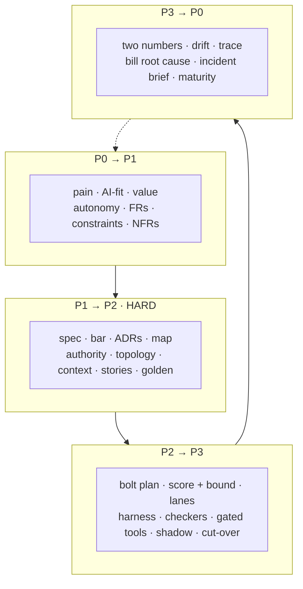

# The evidence pack

The **minimum artefact set**: the few documents owed at each hand-off between phases. Together they are
what you show an auditor, a new team member, or yourself in six months when nobody remembers why the
refund cap is $400.

An artefact is owed when the next phase cannot start without it. Everything else is optional.

Live version: [Evidence pack](https://akash-coded.github.io/aws-bedrock-agentcore-strands/#/evidence/ev-p0).

---

## P0 → P1 · soft

| Artefact | Owner | One line of what good looks like |
| --- | --- | --- |
| The pain as a measurement | PM | Who has it, how often, what it costs today, and the evidence |
| AI-fit verdict | PM | Judgement? Volume? Recoverable? Three answers and a build shape |
| Value line | PM | Cases × minutes × rate, **minus** run cost and review load |
| Autonomy decision record | PM | Per action, with the door named: one-way or two-way |
| Credited FRs and consolidated FRs | Architect | All lines with names, then the consolidation |
| Constraints by type | Architect | Technical, regulatory, commercial — sorted before any target is set |
| Ratified NFRs with sensitivity points | Architect | Six-part scenarios, with three points named for records |

**The test for this hand-off:** can the architect start designing without asking the PM a question?

---

## P1 → P2 · the hard gate

This is the one hand-off that halts. Everything downstream is built and measured against these.

| Artefact | Owner | One line of what good looks like |
| --- | --- | --- |
| The eight-field spec, acceptance in EARS | PM | One screen; a coding agent builds from it unaided |
| Acceptance bar sheet, per slice | PM | Derived from damage and saving, not invented |
| ADRs at the sensitivity points | Architect | One per trade-off point, with what was rejected |
| The exact / best-guess map | Architect | Every step tagged, with the proof each kind needs |
| Authority budget and gate map | Architect | R1–R5 per tool, caps in signatures |
| Agent PRD and topology | Architect | One agent unless a named limit says otherwise |
| Context layers | Architect | Shared → domain → product → task, each versioned |
| Story files | Engineering | Self-contained: context, spec, tools, tests, done-when, cost |
| Golden set, first 50 cases | QA | Real historical cases, tagged by slice |

**The test:** hand the pack to an engineer who was not in the room. If they can build the first bolt
without a conversation, the gate is passable.

---

## P2 → P3 · soft

| Artefact | Owner | One line of what good looks like |
| --- | --- | --- |
| Bolt plan in dependency order | Architect | Each slice buildable and testable alone |
| The score **with its lower bound** | QA | And the number of cases still owed to prove the bar |
| Review lanes by risk band | Engineering | A path rule, not a per-PR argument |
| The bar as a running test, harness in CI | Engineering | A slice below its bar blocks the merge |
| Checker placement and implementation | Engineering | Independent: different model or fresh adversarial context |
| Gated tool implementations | Engineering | Over-cap raises; no-confirm raises; both tested |
| Shadow-run comparison | QA | Decision by decision, over the window, against the threshold |
| Cut-over plan | PM | Five percent first, widen on evidence, rollback rehearsed |

---

## P3 → the next P0 · soft

| Artefact | Owner | One line of what good looks like |
| --- | --- | --- |
| Two-number report | Sponsor | Saving and spend on one line, with the review and re-run rows |
| Drift readout | PM | One output mix, charted weekly, with an alert threshold |
| Redacted trace | Architect | Replayable, and not a breach target |
| Root-cause note for a bill that left its estimate | Architect | One of the four signatures, traced to the decision that allowed it |
| The incident, turned into a brief | PM | Pain, evidence, missing control, fix, value |
| Maturity self-check | Sponsor | A level, its test, and the next control to build |

---

## The pack as one picture

---

## Using the pack

**As a review checklist.** Walk the four artefacts at a design review: the map, the spec, the ADRs and
the authority budget. A review that does not walk them is a look, not a review.

**As an onboarding path.** A new engineer reads the spec, the map and the context layers, in that
order, and can build a bolt on day two.

**As an audit trail.** The pack answers "who decided this, when, on what evidence, and what did they
reject" for every decision that bound the product.

**As a gap report.** Print the four tables. Tick what exists. The ticks you cannot make are your
backlog, in dependency order, for free.

---

## Try it

Pick your current feature and fill in the P1 → P2 table honestly — the hard-gate one.

What to do with the gaps

Two artefacts are missing on almost every team: the **acceptance bar per slice** and the **authority
budget**. They are also the two cheapest to produce, roughly an afternoon each, and they are the two
that show up in production incidents when absent. Build those two before adding anything else to the
pack.

If the **exact / best-guess map** is missing as well, build it first. It is the artefact the other two
are derived from, and it takes twenty minutes for one feature.

---

**Next:** [Gates and Governance](Gates-and-Governance) · [The Agentic PDLC](The-Agentic-PDLC) ·
[Formulas and Calculators](Formulas-and-Calculators) · [Exercises and Answers](Exercises-and-Answers)
