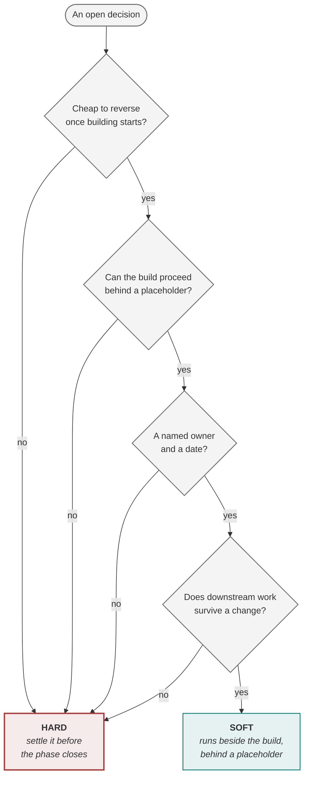

<!-- generated by site/learn_export.py from site/content/learn — edit the source, not this page -->
# The Hard Gate: The One Hand-off You Can't Skip in AI Delivery

*Most decisions in an agentic build should not stop anything. Three must. Knowing which is how you keep speed without buying an incident.*

**6 min read** · Intermediate · Lesson 5 of 9 in [Agentic PDLC fundamentals](Tutorial-Fundamentals) · Updated 23 Sep 2026 · [Read it on the site, with live diagrams ↗](https://akash-coded.github.io/aws-bedrock-agentcore-strands/learn/the-hard-gate/)

> [!TIP]
> **The hard gate in one sentence.** Of the four hand-offs in the agentic PDLC only P1 → P2 halts the
> build, because the spec, the acceptance bar per slice and the authority budget are what everything
> downstream is built and measured against — every other open decision runs alongside the build
> behind a placeholder, with a named owner and a date.

**In this lesson** you'll learn:

- why the P1 → P2 hand-off is the only one that halts the build;
- the four questions that sort any open decision into hard or soft;
- how to cross a gate on credit without losing track of what you owe.

## Sound familiar?

- The build is waiting behind eleven open questions, most of which could have been answered next month.
- A decision that "could be changed later" turned out to be built into everything by the time anyone tried.
- The gate was passed in a meeting that ended in "fine", and nobody can say what evidence was in the room.

Both failures — halting on everything and halting on nothing — come from treating every decision the
same way.

## What is the hard gate?

The [agentic PDLC](What-Is-the-Agentic-PDLC) has four hand-offs between its phases. Three are
**soft**: work may cross with a placeholder, an owner and a date. One is **hard**: nothing enters P2
until three artefacts are signed.

| Artefact | Why nothing downstream survives without it | What happens if it is missing |
| --- | --- | --- |
| **The eight-field spec** | It is what the coding agent reads, and a machine cannot ask what you meant | The agent invents an interpretation, consistently and plausibly |
| **The acceptance bar per slice** | "It works" is no longer yes or no, so someone must say what share is enough | The team ships at whatever number it got and calls that the bar |
| **The authority budget and gate map** | It lists what the machine may do, with caps typed into signatures | The tool accepts any amount, and the cap lives in the prompt |

It sits there because P1 → P2 is the last point at which changing your mind costs a document rather
than a rewrite. It is a **one-way door**; the others are two-way.

## How to decide what is hard, step by step

### Step 1 · Ask the four questions of every open decision

List every decision that is still open, then ask four questions of each, in the order in the
diagram. **One "no" makes it hard.** Can it be reversed cheaply once the build has started? Can the
build proceed behind a placeholder? Is there a named owner and a date? Does everything downstream
survive if the answer changes?

### Step 2 · Settle the hard ones before the phase closes

In a typical build three decisions come back hard, and each for a different reason:

| Hard decision | Why it halts |
| --- | --- |
| The AI-fit verdict | It fixes the shape of the product; changing it later means starting again |
| The autonomy level on money actions | It moves money, and a regulator has a rule about it |
| The spec, the bar and the guardrails | Everything downstream is built and measured against them |

### Step 3 · Put a placeholder behind every soft one

The rest — SkyWays had eight — run beside the build. What makes that safe is a **real placeholder**
that lets the work proceed while the decision is measured: an interface layer in front of the
framework, a stub that returns a file instead of a retrieval system, every call on a mid-tier model
behind a gateway until the shadow run shows which slices need more. Each has an owner and a date on
which it will be settled.

A placeholder that reads "the model behaves sensibly" is not one. That exact placeholder, on the
refund action, cost SkyWays $2,000 on day 82.

### Step 4 · Record the gate decision with its evidence

A gate is a decision with evidence in front of a named person and their name on it — not a click, a
status column or a meeting that ends in "fine". The record says what question the gate asks, what
evidence was in the room, with denominators, and what would have made the answer no.

### Step 5 · If you must cross on credit, write the waiver

Some programmes genuinely cannot wait. Crossing the hard gate without its full set is allowed only
with a written waiver: what is missing, why you are crossing now, the blast radius while it stands,
what you are doing instead, and the date it expires. An undeclared crossing is indistinguishable
from a completed one six weeks later.

<a href="https://akash-coded.github.io/aws-bedrock-agentcore-strands/learn/the-hard-gate/"><picture><source media="(prefers-color-scheme: dark)" srcset="https://akash-coded.github.io/aws-bedrock-agentcore-strands/assets/learn/model-g-baton.dark.webp"></picture></a>

▸ <a href="https://akash-coded.github.io/aws-bedrock-agentcore-strands/learn/the-hard-gate/">Open the live, interactive version</a>

## Where you'll use it

- **At the end of every P1**, however small the change: the three artefacts may be one line each.
- **In the weekly review**, re-asking the four questions of every soft decision — some turn hard as
  the build learns more.
- **When somebody proposes treating everything as hard** "to be safe": that is how a build waits three
  weeks for a reversible framework choice.

## Why it matters

The hard gate is the difference between a limit that was *decided* and a limit that was *enforced*.
SkyWays crossed P1 → P2 with all three artefacts written and the authority budget only partly
implemented: the $400 cap was in the autonomy record and the prompt, and not in the refund tool. One
column in the hand-off record — *implemented, or written down?* — would have caught it.

## Try it

A team has five open decisions at the end of P1: the model family; the refund approval threshold; the
retrieval design; the dashboard layout; and whether a human approves cross-partner rebookings.
**Which are hard?**

Show the answer

**Two: the refund approval threshold and the approval rule for cross-partner rebookings.** Both are
autonomy decisions on consequential actions — money, and a rebooking that is hard to reverse — so
everything downstream, from the tool signatures to the tests, depends on them, and they fail the first
question. The model family can sit behind a gateway, the retrieval design behind a stub, and the
dashboard can wait for P3; each needs only an owner and a date.

## Key takeaways

1. **Only P1 → P2 is hard**: the spec, the bar per slice and the authority budget must be signed before P2 opens.
2. **Four questions, one "no" makes it hard** — reversibility, a placeholder, an owner and a date, and downstream survival.
3. **Every soft decision needs a real placeholder**, and every crossing on credit needs a written waiver.

## FAQ

### What is the difference between a hard gate and a soft gate?

A hard gate halts the work until its evidence exists; a soft gate lets work continue behind a
placeholder while the decision is measured, provided it has a named owner and a date. In the agentic
PDLC only the P1 → P2 hand-off is hard, along with the handful of decisions that fail at least one of
the four questions.

### What are one-way and two-way door decisions?

The terms come from Amazon: a two-way door decision can be reversed cheaply, so it should be made
quickly by a small group; a one-way door is hard or impossible to reverse, so it deserves care and
evidence. The hard gate is a one-way door; the soft gates are two-way.

### Doesn't a hard gate slow delivery down?

One hard gate is fast; eleven are slow. Holding only the decisions that are genuinely expensive to
reverse, and letting the rest run behind placeholders, is what lets the build start early without
building on decisions that will move.

### Who signs the hard gate?

The solution architect is accountable for P1 and signs its exit; the product manager and architect
jointly own the plan gate — the bolt cut, the authority budget and the gate map. A waiver for crossing
without the full set is approved by the sponsor.

## Sources and credits

| Idea | Origin | Source |
| --- | --- | --- |
| One hard hand-off, three soft ones, and the four classifying questions | **Original** — this playbook | [Gates and Governance](Gates-and-Governance#hard-gates-and-soft-gates) |
| The hard-gate waiver | **Original** — this playbook | [The Agentic PDLC](The-Agentic-PDLC#the-one-hard-hand-off--p1--p2) |
| Gates opened by evidence | **Borrowed** | Cooper, R. G. (1990). Stage-gate systems. *Business Horizons* 33(3) |
| One-way and two-way doors | **Borrowed** | Bezos, J. 2015 letter to Amazon shareholders — Type 1 and Type 2 decisions |
| Architecture decisions recorded where they are sensitive | **Borrowed** | Nygard, M. (2011). Documenting architecture decisions |
| The SkyWays figures | **Illustrative** — a fictional airline | [The simulator](https://akash-coded.github.io/aws-bedrock-agentcore-strands/simulator/#/) |

---

| | |
| :--- | ---: |
| [← P1 · Design & Spec](P1-Design-and-Spec-Write-a-Spec-an-Agent-Can-Build) | [P2 · Build & Prove →](P2-Build-and-Prove-Build-an-AI-Agent-in-Slices) |

**[All lessons](Start-Here)** · **[Agentic PDLC fundamentals](Tutorial-Fundamentals)** · [This lesson on the site](https://akash-coded.github.io/aws-bedrock-agentcore-strands/learn/the-hard-gate/)
