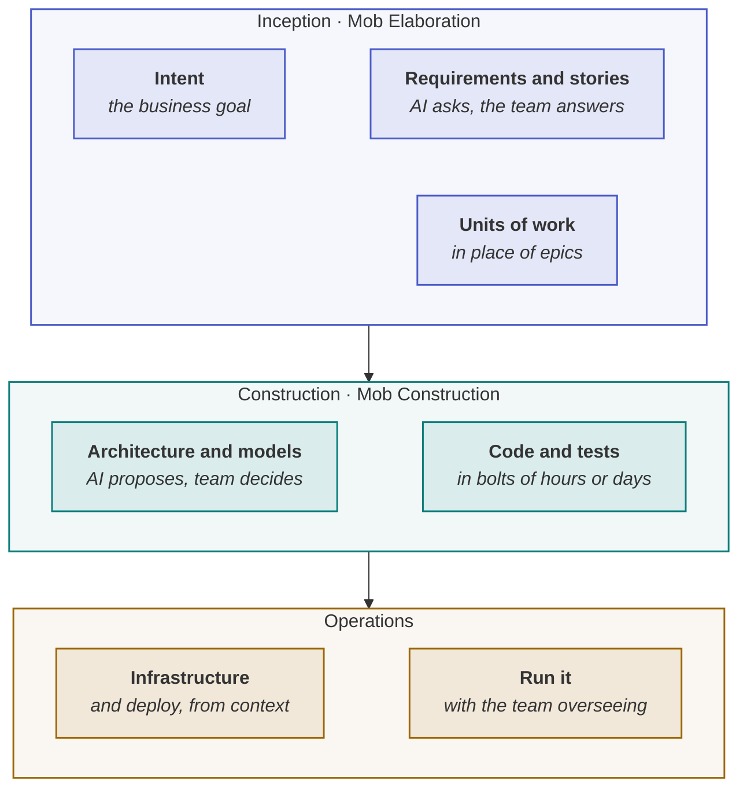

<!-- generated by site/learn_export.py from site/content/learn — edit the source, not this page -->
# What Is AI-DLC? The AI-Driven Development Lifecycle Explained

*Three phases, two rituals, one new unit of work — and what AI-DLC deliberately leaves for you to decide.*

**7 min read** · Beginner · Lesson 2 of 7 in [Methods decoded](Tutorial-Methods-Decoded) · Updated 23 Sep 2026 · [Read it on the site, with live diagrams ↗](https://akash-coded.github.io/aws-bedrock-agentcore-strands/learn/what-is-ai-dlc/)

> [!TIP]
> **AI-DLC in one sentence.** The AI-Driven Development Life Cycle, published by AWS in July 2025, is
> a methodology in which AI creates the plans, asks the clarifying questions and does the
> implementation while people make the critical decisions, run in three phases — **Inception**,
> **Construction** and **Operations** — in short **bolts** of hours or days instead of sprints, with
> the whole team validating the AI's proposals together in **mob** sessions.



**In this lesson** you'll learn:

- AI-DLC's three phases, its two mob rituals, and what a bolt and a unit of work are;
- how its open-source adaptive workflows decide how much process a task gets;
- where it sits on the agentic PDLC, and the decisions it leaves to you.

## Sound familiar?

- The coding agent builds a story in hours, then waits two weeks for the sprint review.
- Requirements are "clarified" in a thread nobody else reads, and the agent builds its own interpretation.
- Every task, from a typo to a new service, gets the same ceremony — so the team starts skipping it.

AI-DLC was written for exactly these three: planning cycles too long for how fast AI builds,
clarification that happens in private, and process that does not scale with the task.

## What is AI-DLC?

AI-DLC — the **AI-Driven Development Life Cycle** — is a software engineering methodology introduced
by Raja SP of AWS in July 2025. Its central inversion is who starts the work: the AI **initiates**,
producing plans, questions and implementations, and people **validate**, making the decisions that
need judgement, accountability or context the AI does not have. It describes itself as a
machine–human collaboration, where earlier methods such as Scrum were designed around people doing
all of the work.

## How AI-DLC works, step by step

### Step 1 · Inception — turn intent into units of work, together

The team states a business intent, and the AI turns it into requirements, stories and **units of
work** — AI-DLC's replacement for epics. It does this through **Mob Elaboration**: the whole team in
one session, answering the AI's clarifying questions and validating its proposals in real time,
instead of each person reviewing a document alone.

### Step 2 · Construction — AI proposes the design and the code, the team decides

Using the validated context from Inception, the AI proposes a logical architecture, domain models,
code and tests. **Mob Construction** is the equivalent ritual: the team clarifies technical decisions
and architectural choices as they arise. Engineering disciplines such as domain-driven design and
test-driven development are part of the workflow rather than optional extras.

### Step 3 · Operations — deploy from the context you built up

In Operations the AI applies everything accumulated in the earlier phases to infrastructure as code
and deployment, with the team overseeing. The context is the thread that runs through all three
phases: each one hands the next a record rather than a conversation.

### Step 4 · Work in bolts, not sprints

A **bolt** is AI-DLC's unit of iteration: a shorter, more intense cycle measured in hours or days
rather than weeks. When an agent can build a story in an afternoon, a two-week sprint leaves it idle
for most of the fortnight; the bolt matches the planning cycle to the building speed.

### Step 5 · Let the workflow size itself

In November 2025 AWS open-sourced AI-DLC's **adaptive workflows**, which choose both the breadth of a
task — which stages to include — and the depth of each stage, from the complexity of the intent. A
simple defect fix skips elaborate requirements analysis; a new service gets the full treatment. The
project, `awslabs/aidlc-workflows`, is MIT-0 licensed and runs inside several coding agents,
including Claude Code, Kiro, Cursor, Codex and GitHub Copilot.

## How AI-DLC fits the agentic PDLC

AI-DLC is a method for **building with AI**. The [agentic PDLC](What-Is-the-Agentic-PDLC) is a
lifecycle for **products with AI inside them**. They combine rather than compete:

| AI-DLC | Sits in | What the agentic PDLC adds around it |
| --- | --- | --- |
| Inception | P0 and P1 | Whether the job needs a model at all; the value line; autonomy per action |
| Construction | P2 | An acceptance bar per slice, a harness that gates the merge, a shadow run |
| Operations | P3 | A drift watch against two thresholds, and the saving reported beside the spend |
| Bolts | P2 | One unknown per bolt, the walking skeleton first |
| Adaptive depth | Every phase | The same principle, applied per change by risk band rather than by size |

The reason both are needed is that AI-DLC tells you how to build fast and deliberately, and says
little about how right a *product that calls a model* must be, or who may authorise each of its
actions. If your shipped software only runs deterministic code that an agent wrote, AI-DLC may be
most of what you need. If it calls a model, you need the rest.

## Where you'll use it

- **When your team builds with coding agents** and the sprint no longer matches the building speed.
- **When clarification keeps happening in private threads** — mob sessions make it shared and recorded.
- **When process is one-size-fits-all** — adaptive depth is the fix, whichever method you run.

## Why it matters

AI-DLC is the most complete published answer, from a major vendor, to how software teams should
reorganise when AI does most of the building. Knowing precisely what it covers — and what it does
not — lets you adopt it without assuming it also decides your acceptance bars and guardrails.

## Try it

A team adopts AI-DLC. Inception produces units of work for a claims assistant that will approve small
insurance claims on its own. Construction is under way in daily bolts. **Name one decision the
team still needs that AI-DLC's three phases do not make for them.**

<details><summary>Show the answer</summary>

**Any of these:** how accurate the approvals must be for each kind of claim, derived from what a wrong
approval costs; which approvals the agent may make alone and which need a person; where the approval
limit is enforced so a prompt cannot talk the agent past it; how long the agent runs in shadow
before it acts; and how drift in its approval rate will be caught. They are product decisions about
the model inside the software, which is what the agentic PDLC's P0 and P1 are for.

</details>

## Key takeaways

1. **AI-DLC** is AWS's 2025 methodology: AI initiates and proposes, people validate and decide.
2. It runs **Inception, Construction and Operations**, with **mob rituals**, **units of work** and **bolts** of hours or days.
3. It is a **building method**; for software with a model inside it, pair it with a product lifecycle such as the agentic PDLC.

## FAQ

### Is AI-DLC only for AWS?

No. It is a methodology, not a service. Its open-source adaptive workflows run inside several coding
agents, including Claude Code, Kiro, Cursor, Codex and GitHub Copilot, and nothing in it requires AWS
infrastructure.

### What is Mob Elaboration?

The Inception ritual in which the whole team works through the AI's clarifying questions and
proposals together, in real time, as the AI turns a business intent into requirements, stories and
units of work. Mob Construction is the equivalent during Construction, for technical decisions.

### What is a bolt in AI-DLC?

A bolt is AI-DLC's replacement for the sprint: a shorter, more intense cycle measured in hours or
days rather than weeks, sized to how quickly an AI can build.

### Is AI-DLC the same as AIDD or AIDDLC?

No. AIDD is a general term for building with AI tools. AIDDLC is a separate seven-phase standard
from a different author, despite the near-identical name. AI-DLC is AWS's three-phase method.

### Is AI-DLC open source?

Its adaptive workflows are: AWS published them in November 2025 as `awslabs/aidlc-workflows`, under
the MIT-0 licence.

## Apply it in your role

| If you are… | Do this | The AI-augmented shortcut |
| --- | --- | --- |
| **A forward-deployed engineer** | Run Mob Elaboration with the customer: the AI proposes units of work and asks the questions, the customer's people answer in the room, and the answers become the spec. | Have a model generate the clarifying questions from the brief beforehand, so the session starts at the hard ones. |
| **A product manager or FDPM** | Plan in bolts of hours or days, and treat the AI's plan as a proposal to validate, not accept. The critical decisions stay yours. | Ask the model to list its own assumptions in the plan, each with how you would check it. |
| **A GenAI or agentic AI engineer** | Keep the accumulated context — decisions, records, specs — in the repository, so every bolt starts informed. | Have the coding agent read the context folder first and say what it will build before it builds. |

**Across the enterprise.** AI-DLC scales across teams when the context artefacts are standard and the
mob rituals are timeboxed. Add what the method leaves to you: the bar per slice and the authority budget.

**The ten-minute workflow.** Prepare a Mob Elaboration session so the room's time goes on decisions:

```text
Here is an intent: <one paragraph>. Act as the facilitator of a Mob Elaboration session. Propose the
units of work, then list the clarifying questions the team must answer before building, ordered by
how much of the plan each answer changes. For each question, say who in the room should answer it.
```

## Sources and credits

| Idea | Origin | Source |
| --- | --- | --- |
| AI-DLC: its principle, phases, rituals, units of work and bolts | **Borrowed** | Raja SP (2025). [AI-Driven Development Life Cycle: Reimagining Software Engineering](https://aws.amazon.com/blogs/devops/ai-driven-development-life-cycle). AWS, 31 July |
| Adaptive breadth and depth per task | **Borrowed** | Matos, W., Jain, R., Jog, S. & Raja SP (2025). [Open-sourcing adaptive workflows for AI-DLC](https://aws.amazon.com/blogs/devops/open-sourcing-adaptive-workflows-for-ai-driven-development-life-cycle-ai-dlc/). AWS, 29 November |
| The adaptive workflow rules and the harnesses they run in | **Borrowed** | [awslabs/aidlc-workflows](https://github.com/awslabs/aidlc-workflows) |
| AI-DLC as a machine–human methodology, with DDD and TDD built in | **Borrowed** | IBM. [What is AI-DLC?](https://www.ibm.com/think/topics/ai-dlc) |
| The mapping onto P0–P3, and what the lifecycle adds | **Original** — this playbook | [The Agentic PDLC](The-Agentic-PDLC#how-the-named-methods-sit-on-the-spine) |

---

| | |
| :--- | ---: |
| [← AI-DLC vs AIDD vs agentic SDLC](AI-DLC-vs-AIDD-vs-Agentic-SDLC-vs-PDLC) | [What is AIDD? →](What-Is-AIDD-AI-Driven-Development) |

**[All lessons](Start-Here)** · **[Methods decoded](Tutorial-Methods-Decoded)** · [This lesson on the site](https://akash-coded.github.io/aws-bedrock-agentcore-strands/learn/what-is-ai-dlc/)

<sub>✏️ This page is generated from [`site/content/learn/lessons/what-is-ai-dlc.md`](https://github.com/akash-coded/aws-bedrock-agentcore-strands/blob/main/site/content/learn/lessons/what-is-ai-dlc.md). To change it, [edit the lesson](https://github.com/akash-coded/aws-bedrock-agentcore-strands/edit/main/site/content/learn/lessons/what-is-ai-dlc.md) — an edit made here is replaced at the next sync.</sub>
