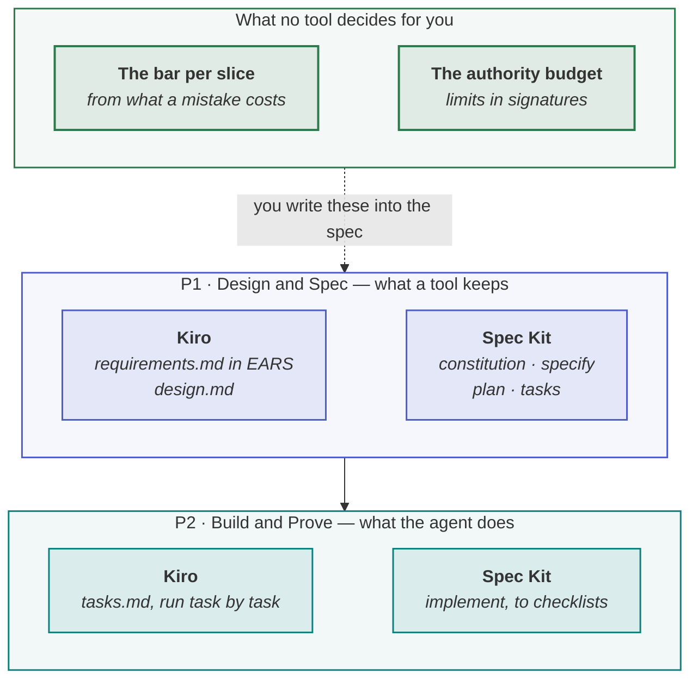

<!-- generated by site/learn_export.py from site/content/learn — edit the source, not this page -->
# What Is Spec-Driven Development? Kiro and Spec Kit Explained

*The spec becomes the thing you maintain. Two tools, three levels of commitment — and the part no tool decides for you.*

**6 min read** · Beginner · Lesson 5 of 7 in [Methods decoded](Tutorial-Methods-Decoded) · Updated 23 Sep 2026 · [Read it on the site, with live diagrams ↗](https://akash-coded.github.io/aws-bedrock-agentcore-strands/learn/what-is-spec-driven-development/)

> [!TIP]
> **Spec-driven development in one sentence.** Spec-driven development (SDD) means writing a
> specification before any code and keeping it as the artefact that AI agents build from — as in
> AWS's **Kiro**, which keeps requirements, design and tasks files, and **GitHub Spec Kit**, which
> moves work from a constitution through specify, plan and tasks to implementation — so that the spec,
> not a chat history, is what people review and what the agent reads.



**In this lesson** you'll learn:

- what spec-driven development is, and its three levels of commitment;
- how Kiro and GitHub Spec Kit each put it into practice;
- the honest critiques, and the parts of a spec that a tool cannot fill in.

## Sound familiar?

- The agent built something plausible and wrong, because the only "spec" was a chat thread it half-remembered.
- Six months later nobody knows why the code behaves as it does, because the reasoning lived in a conversation.
- A spec tool generated four long markdown files for a one-line bug fix, and nobody read them.

The first two are the problem spec-driven development solves. The third is the problem it can
create, and the reason depth matters.

## What is spec-driven development?

Spec-driven development is writing a spec before writing code with AI — documentation first — and
treating that spec as the authoritative reference for both people and agents. Birgitta Böckeler,
writing on Martin Fowler's site in October 2025, distinguishes three levels of commitment:

| Level | What happens to the spec | Commitment |
| --- | --- | --- |
| **Spec-first** | Written before the task, then discarded when it is done | Low |
| **Spec-anchored** | Kept after the task, and evolved with the feature | Medium |
| **Spec-as-source** | The primary artefact; people edit only the spec and the code is generated | High |

This playbook asks for **spec-anchored** on every change: the spec is the one artefact that survives
the code, and a change with no spec change is a change nobody can review.

## How the tools do it, step by step

### Step 1 · Kiro: requirements, design, tasks

Kiro, AWS's agentic IDE released in public preview in July 2025, keeps three files per feature.
`requirements.md` holds user stories with acceptance criteria in **EARS** — *WHEN … THE SYSTEM
SHALL …* — the requirements syntax developed at Rolls-Royce. `design.md` holds the architecture,
data flow and testing strategy. `tasks.md` is the implementation plan, each task traceable to a
requirement. You can start from requirements or from design.

### Step 2 · GitHub Spec Kit: constitution, specify, plan, tasks, implement

GitHub Spec Kit, open-sourced on 2 September 2025, is a toolkit of templates and commands that work
inside coding agents such as GitHub Copilot, Claude Code and Gemini CLI. It moves work through a
**constitution** of project-wide principles, then **specify**, **plan** and **tasks**, and finally
**implement**, with checklists that serve as the definition of done at each step.

### Step 3 · Choose the level of commitment per change

Neither tool decides how much of this a change needs. A defect fix may need one updated acceptance
line; a new feature needs all of it. Pick the level — and the depth — from the risk of the change, not
from the tool's default. [How much process a change needs](How-Much-Process-Does-a-Change-Need).

### Step 4 · Fill in what the tool cannot

A spec tool gives you the places to write things down. It does not know how accurate the agent in
your product must be, which of its actions need a person, or where a limit must be enforced. Those
are the five agentic fields of this playbook's [eight-field spec](P1-Design-and-Spec-Write-a-Spec-an-Agent-Can-Build#step-2--write-the-eight-field-spec)
— the model's role, autonomy per action, the bar per slice, the fallback and the records — and they
belong in the requirements file whichever tool holds it.

## The honest critiques

Böckeler's review is worth reading before you adopt either tool. Her main points:

- **Workflow mismatch.** The tools do not scale their process to the size of the problem, so small
  bugs get elaborate treatment.
- **Review burden.** Long generated markdown files can be more tedious to review than the code.
- **An illusion of control.** Agents still ignore or over-interpret instructions, however full the spec.
- **An old echo.** Spec-as-source recalls model-driven development, with the risk of combining
  inflexibility with non-determinism.

Each critique is an argument for **depth by change** and for **checks that do not depend on the agent
reading the spec**: the harness, the tool signatures and the tests.

## Where you'll use it

- **On every change**, at the depth it needs: at minimum, the spec is updated and reviewed.
- **As the input a coding agent builds from**, in place of a chat thread.
- **As the record an auditor or a new engineer reads** to find out why the system behaves as it does.

## Why it matters

A coding agent builds whatever it understands. Spec-driven development moves the understanding out
of a conversation and into a file that people review, version and keep — which is what makes the
agent's output reviewable, and the system maintainable, after the conversation is gone.

## Try it

A team uses Spec Kit. Its specify step produced a thorough feature spec for a refund assistant, with
user stories and acceptance criteria. **What should the architect check is in the spec before the
work crosses into the build?**

<details><summary>Show the answer</summary>

**The five agentic fields.** The model's role (which steps the model decides and which are exact
code), autonomy per action (which refunds may be issued alone and which need an approver), the
acceptance bar per slice derived from what a wrong refund costs, the fallback when the model cannot
decide, and what every refund must record. Spec Kit provides the structure; these decisions are the
team's, and the refund limit must also exist in the refund tool's signature, not only in the spec.

</details>

## Key takeaways

1. **Spec-driven development** writes the spec first and keeps it as the artefact agents build from.
2. **Kiro** keeps requirements, design and tasks files; **Spec Kit** runs constitution, specify, plan, tasks and implement.
3. The tools hold the spec; **you** still decide its depth, its bars and its limits — and enforce the limits in code.

## FAQ

### What is the difference between spec-driven development and test-driven development?

Test-driven development writes a failing test before the code that makes it pass. Spec-driven
development writes the specification — requirements, design and tasks — before any code, for an AI
agent to build from. They combine well: the acceptance criteria in the spec become the tests.

### What are requirements.md, design.md and tasks.md?

The three files Kiro keeps for each feature: the requirements, as user stories with acceptance
criteria in EARS notation; the technical design; and the implementation plan, as tasks traceable to
the requirements.

### Is spec-driven development the same as AI-DLC?

No, though they fit together. Spec-driven development is about what agents build from; AWS's AI-DLC is
a wider methodology with phases, mob rituals and bolts. An AI-DLC team would typically keep its
Inception output as a spec.

### Do I need Kiro or Spec Kit to do spec-driven development?

No. The practice is writing and keeping the spec; the tools make it convenient inside a coding agent.
A markdown file in the repository, read by path from the agent's context file, is spec-driven
development.

## Apply it in your role

| If you are… | Do this | The AI-augmented shortcut |
| --- | --- | --- |
| **A forward-deployed engineer** | Make the spec the contract: requirements in EARS, design and tasks, reviewed by the customer's people before any code. | Have Kiro or Spec Kit generate the requirements file, then walk it line by line with the customer's owner. |
| **A product manager or FDPM** | Write the bar and the authority budget into the spec yourself. No SDD tool decides them. | Ask a model to find every requirement in the spec that has no measure. |
| **A GenAI or agentic AI engineer** | Implement task by task against the spec, and update the spec when reality disagrees. A stale spec is worse than none. | After each task, have the agent diff the spec against the code and propose spec edits. |

**Across the enterprise.** Adopt one SDD tool where you can and keep specs in the repository, so specs
are reviewed like code across teams and survive the people who wrote them.

**The ten-minute workflow.** Review a spec the way a coding agent will misread it:

```text
Here is our spec — requirements, design and tasks: <paste>. Find (1) requirements without a
measurable acceptance criterion, (2) actions with no stated limit or approver, and (3) tasks that
implement nothing in the requirements. Output three lists with line references.
```

## Sources and credits

| Idea | Origin | Source |
| --- | --- | --- |
| Spec-first, spec-anchored and spec-as-source, and the critiques | **Borrowed** | Böckeler, B. (2025). [Understanding spec-driven development: Kiro, spec-kit and Tessl](https://martinfowler.com/articles/exploring-gen-ai/sdd-3-tools.html). 15 October |
| Kiro's requirements, design and tasks, with EARS | **Borrowed** | Kiro. [Specs](https://kiro.dev/docs/specs/) · [Introducing Kiro](https://kiro.dev/blog/introducing-kiro/) |
| Spec Kit's workflow | **Borrowed** | GitHub (2025). [Spec-driven development with AI](https://github.blog/ai-and-ml/generative-ai/spec-driven-development-with-ai-get-started-with-a-new-open-source-toolkit/). 2 September |
| EARS | **Borrowed** | Mavin, A. et al. (2009). Easy Approach to Requirements Syntax. *IEEE RE'09* |
| Spec-anchored on every change; the five agentic fields | **Original** — this playbook | [The Agentic PDLC](The-Agentic-PDLC#how-the-named-methods-sit-on-the-spine) |

---

| | |
| :--- | ---: |
| [← What is the BMAD Method?](What-Is-the-BMAD-Method) | [One lifecycle for every method →](One-Lifecycle-for-AI-DLC-BMAD-Spec-Kit-and-Scrum) |

**[All lessons](Start-Here)** · **[Methods decoded](Tutorial-Methods-Decoded)** · [This lesson on the site](https://akash-coded.github.io/aws-bedrock-agentcore-strands/learn/what-is-spec-driven-development/)

<sub>✏️ This page is generated from [`site/content/learn/lessons/what-is-spec-driven-development.md`](https://github.com/akash-coded/aws-bedrock-agentcore-strands/blob/main/site/content/learn/lessons/what-is-spec-driven-development.md). To change it, [edit the lesson](https://github.com/akash-coded/aws-bedrock-agentcore-strands/edit/main/site/content/learn/lessons/what-is-spec-driven-development.md) — an edit made here is replaced at the next sync.</sub>
