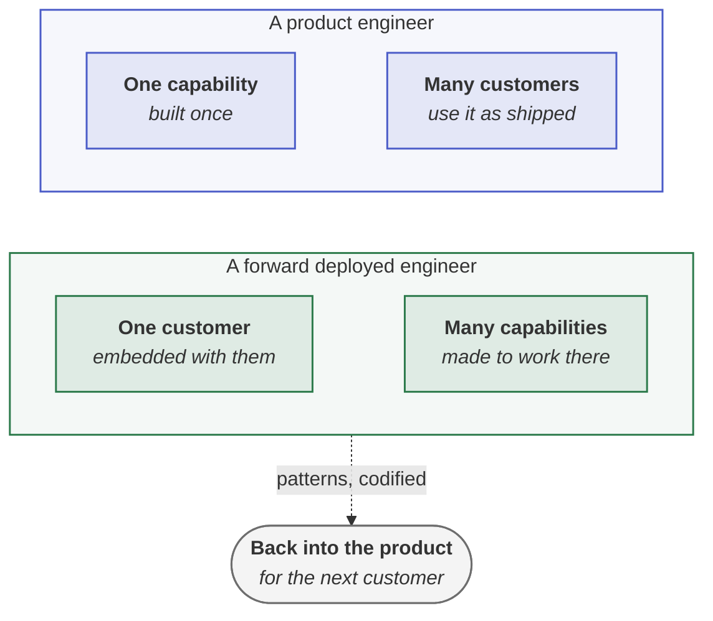

<!-- generated by site/learn_export.py from site/content/learn — edit the source, not this page -->
# What Is a Forward Deployed Engineer? The FDE Role, Explained

*One engineer, one customer, many capabilities — and a duty to carry what the customer taught them back into the product.*

**7 min read** · Beginner · Lesson 1 of 7 in [Interviews and careers](Tutorial-Interviews-and-Careers) · Updated 23 Sep 2026 · [Read it on the site, with live diagrams ↗](https://akash-coded.github.io/aws-bedrock-agentcore-strands/learn/what-is-a-forward-deployed-engineer/)

> [!TIP]
> **The role in one sentence.** A forward deployed engineer (FDE) is a software engineer who embeds with
> a customer to make a complex product work in the customer's own environment — owning discovery,
> scoping, build and rollout — and who carries the patterns they find back into the product. The role
> began at Palantir in the early 2010s; frontier AI labs such as OpenAI and Anthropic now hire FDEs to put
> models into production with their most strategic customers.



**In this lesson** you'll learn:

- what an FDE actually does, in the words of the companies that hire them;
- how the role differs from a solutions architect, a solutions engineer and a consultant;
- what makes an FDE good at the job, and where the forward-deployed PM fits.

## Sound familiar?

- The model works in the demo and nowhere near the customer's systems, data or approvals.
- Every enterprise deal ends in a custom build nobody at the vendor can maintain.
- The product team learns what customers need from sales notes, months late.

The FDE exists because all three are the same problem: the distance between a capable product and a
working deployment.

## What does a forward deployed engineer do?

**Writes production software inside a customer's environment, and owns the whole path to value.**
Palantir, which created the role, framed it against its product engineers: a product engineer's focus is
"one capability, many customers", while a forward deployed engineer's is "one customer, many
capabilities". The public descriptions from AI labs make the modern version concrete:

| Company | What the posting says an FDE owns |
| --- | --- |
| **OpenAI** | End-to-end deployments of frontier models with strategic customers: discovery, technical scoping, system design, build and production rollout — measured by production adoption, workflow impact, and eval-driven feedback that changes product and model roadmaps |
| **Anthropic** | Production applications with Claude inside customer systems, and technical artefacts such as MCP servers, sub-agents and agent skills — plus codifying repeatable deployment patterns for the product and engineering teams |

Two threads run through both: **the FDE ships to production, not to a demo**, and **the FDE's second
customer is their own product team**.

## How the role works, step by step

### Step 1 · Discover in the customer's data, not the pitch

The first weeks are spent where the work happens: measuring the pain in cases, minutes and money,
reading the systems the agent must touch, and finding who owns the risk. Lead-time items — model
access, data access, security review — start on day one, because they set the calendar.
[AI-DLC and AIDD in the field](AI-DLC-and-AIDD-for-Forward-Deployed-Engineers)

### Step 2 · Scope the smallest thing that can be proven

An FDE says no more than most engineers: to the flagship first feature, to building past an unsigned
autonomy decision, to meetings that produce no artefact. The first slice is chosen for provability —
high volume, low damage per mistake, an existing process to compare against.

### Step 3 · Build in their stack, with their people

The code lives in the customer's repository, runs in their environment and uses their identity model.
The customer's engineers pair on it, so that what is built is maintainable by the people who stay.

### Step 4 · Prove it with their evidence

The customer's experts label the golden set, the customer's risk owner signs the bar, and a shadow run
compares the agent with their staff. An FDE's claims are the customer's numbers, not the vendor's.

### Step 5 · Hand over, and bring the pattern home

The engagement ends with an evidence pack, runbooks and named owners — and, back at the vendor, with the
patterns written up: the connector built for the third time, the evaluation that exposed a model gap.

## How is an FDE different from a solutions architect?

| Role | Mainly produces | Writes production code? | Owns the outcome at the customer? |
| --- | --- | --- | --- |
| **Forward deployed engineer** | Working software in the customer's environment | Yes, most of the time | Yes, through rollout |
| **Solutions architect** | Designs and guidance | Sometimes, as reference code | Advises; the customer builds |
| **Solutions or sales engineer** | Demos and proofs of concept before the sale | Prototype code | Until the deal closes |
| **Consultant** | Delivered projects, often bespoke | Yes | For the contract's scope |

The distinction that matters most is the last column combined with the feedback duty. A consultant can
succeed with bespoke work; an FDE who only ever builds bespoke work has turned a product company into a
services firm. OpenAI's own framing, as reported, distinguishes its FDEs from the professional-services
work of a solutions architect.

## Where does the forward deployed PM fit?

A **forward deployed product manager (FDPM)** works from inside the same deployments and owns the *what*
and *why* while the FDE owns the *how*. The FDPM's hardest call is sorting every customer request into
configuration, a service, or a product capability — and defending that call to the customer and to the
product team. The title is posted by companies including Scale AI, Salesforce and Cresta.

## Where you'll use it

- **When hiring or joining an FDE team**, to know which of the five steps the role is really accountable for.
- **When scoping an enterprise AI deal**, to decide what the FDE owns and what the customer must.
- **When an engagement drifts into bespoke work**, to put the product feedback duty back on the plan.

## Why it matters

Models are capable; deployments are hard. Most of the distance between the two is integration, access,
evidence and trust — work that is specific to one customer and cannot be done from a distance. The FDE is
how a product company closes that distance without becoming a consultancy, provided the patterns flow back.

## Try it

A customer asks their FDE to build a fourth custom integration with their ticketing system, the same as
three the FDE built for other customers. **What should the FDE do, and who else needs to know?**

<details><summary>Show the answer</summary>

**Build it once more only as the reusable version, and take the pattern home.** Three copies of the same
integration are a product gap, not a customer request: the FDE should build it as a configurable
connector — an MCP server, say — and write the case for the product team with the evidence of all four
customers. The FDPM, if there is one, decides whether it becomes product; the customer gets a supported
capability instead of a fourth bespoke fork.

</details>

## Key takeaways

1. **An FDE owns production outcomes at one customer**, from discovery to rollout.
2. **The second customer is the product team**: repeated work becomes a pattern, then a product.
3. **FDEs say no by design** — to the flagship first, to unsigned autonomy, to bespoke forks.

## FAQ

### What does FDE stand for?

Forward deployed engineer: a software engineer who works embedded with a customer to deploy and adapt a
product in the customer's environment. Palantir's original title was forward deployed software engineer.

### Is a forward deployed engineer a software engineer?

Yes. FDEs write production code, usually in the customer's systems and stack, but the job also includes
discovery, scoping, stakeholder work and evaluation, so the balance of the week differs from a product
engineer's.

### What skills does a forward deployed engineer need?

Strong programming, fast learning of unfamiliar systems, discovery with non-technical stakeholders,
evaluation design for AI systems, security and identity basics, and the judgement to say no to work that
cannot be proven or maintained.

### What is the difference between an FDE and an FDPM?

The FDE owns how a capability is built and deployed at a customer; the forward deployed product manager
owns what is built and why, and decides which customer needs become product capabilities.

## Apply it in your role

| If you are… | Do this | The AI-augmented shortcut |
| --- | --- | --- |
| **A forward-deployed engineer** | Keep a pattern log from day one: every problem you solve twice at any customer. | Ask a model each Friday to turn the week's notes into pattern entries with customer evidence. |
| **A product manager or FDPM** | Review the FDE pattern log monthly and decide configuration, service or product for each entry. | Have a model rank the log by customers affected and revenue at stake. |
| **A GenAI or agentic AI engineer** | Treat FDE-built connectors as product prototypes: harden the ones with three users into supported tools. | Ask a coding agent to diff the customer copies and propose the shared interface. |

**Across the enterprise.** Run FDEs as a programme with a feedback budget: a fixed share of every
engagement goes to codifying patterns, and the product roadmap has a standing slot for them.

**The ten-minute workflow.** Keep the pattern log honest:

```text
Here are my notes from this week's customer work: <paste>. Extract every problem I solved, and mark the
ones I have solved before at any customer (check against this log: <paste the log>). For each repeat,
write a pattern entry: the problem, the fix, the customers, and whether it should become configuration,
a reusable service or a product capability.
```

## Sources and credits

| Idea | Origin | Source |
| --- | --- | --- |
| The role's origin at Palantir; "one capability, many customers" against "one customer, many capabilities" | **Borrowed** | Orosz, G. (2025, 12 August). [What are Forward Deployed Engineers, and why are they so in demand?](https://newsletter.pragmaticengineer.com/p/forward-deployed-engineers) *The Pragmatic Engineer* |
| What an OpenAI FDE owns and how success is measured | **Borrowed** — public posting, September 2026 | [OpenAI careers: Forward Deployed Engineer](https://openai.com/careers/forward-deployed-engineer-(fde)-sf-san-francisco/) |
| What an Anthropic FDE delivers | **Borrowed** — public posting, September 2026 | [Anthropic: Forward Deployed Engineer, Applied AI](https://job-boards.greenhouse.io/anthropic/jobs/5391021008) |
| The forward deployed PM owns what and why at the point of deployment | **Borrowed** — public postings | Scale AI, Salesforce and Cresta job postings for Forward Deployed Product Manager, September 2026 |
| The five steps and the pattern log | **Original** — this tutorial | [AI-DLC and AIDD for FDEs](AI-DLC-and-AIDD-for-Forward-Deployed-Engineers) |

---

| | |
| :--- | ---: |
| [← Twelve exercises](Agentic-PDLC-Exercises-with-Answers) | [Six answer frameworks →](How-to-Answer-AI-Interview-Questions) |

**[All lessons](Start-Here)** · **[Interviews and careers](Tutorial-Interviews-and-Careers)** · [This lesson on the site](https://akash-coded.github.io/aws-bedrock-agentcore-strands/learn/what-is-a-forward-deployed-engineer/)

<sub>✏️ This page is generated from [`site/content/learn/lessons/what-is-a-forward-deployed-engineer.md`](https://github.com/akash-coded/aws-bedrock-agentcore-strands/blob/main/site/content/learn/lessons/what-is-a-forward-deployed-engineer.md). To change it, [edit the lesson](https://github.com/akash-coded/aws-bedrock-agentcore-strands/edit/main/site/content/learn/lessons/what-is-a-forward-deployed-engineer.md) — an edit made here is replaced at the next sync.</sub>
