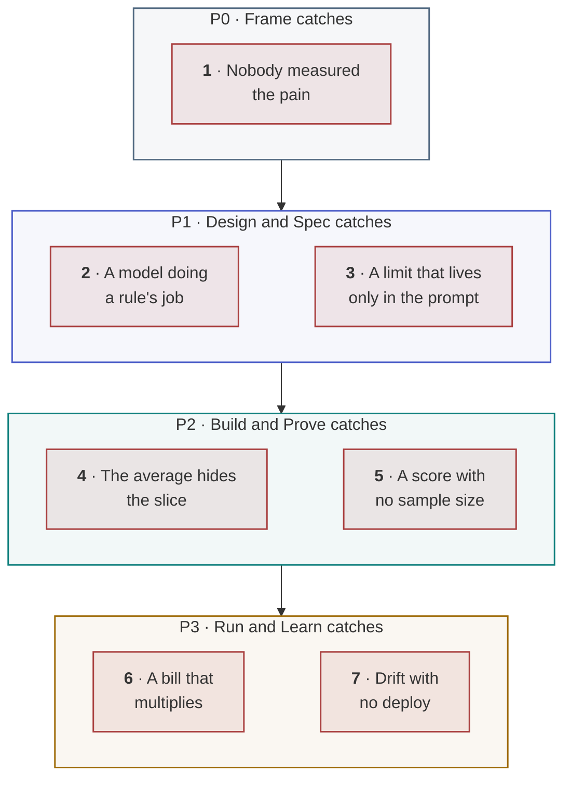

<!-- generated by site/learn_export.py from site/content/learn — edit the source, not this page -->
# Why Agentic AI Projects Fail: 7 Failure Modes and Their Fixes

*None of these failures throws an error. That is why the tests stay green, the dashboard stays up, and the project is cancelled anyway.*

**6 min read** · Beginner · Lesson 2 of 9 in [Agentic PDLC fundamentals](Tutorial-Fundamentals) · Updated 23 Sep 2026 · [Read it on the site, with live diagrams ↗](https://akash-coded.github.io/aws-bedrock-agentcore-strands/learn/why-agentic-ai-projects-fail/)

> [!TIP]
> **Why agentic AI projects fail, in one sentence.** They fail quietly: a model is right most of the
> time and wrong without an error, so the checks a team already has — green tests, a working demo, a
> rising average — keep reporting success while the value goes unmeasured, a limit lives only in a
> prompt, one slice falls below its bar, the bill multiplies and behaviour drifts.

**In this lesson** you'll learn:

- the seven ways agentic projects fail, each with a worked example;
- why tests, demos and dashboards miss every one of them;
- which phase of the agentic PDLC catches each, and how.

## Sound familiar?

- The tests are green, the demo is impressive, and the pilot has been "nearly ready" for two months.
- The overall accuracy went up this week, and so did the complaints.
- Nobody can say what the feature is worth, but everybody can say what it cost last month.

Every one of those is a failure that raises no error. The fix is not more care; it is checks aimed at
the right things.

## Why do agentic AI projects fail?

In June 2025 Gartner predicted that **over 40% of agentic AI projects will be cancelled by the end of
2027**, citing three causes: escalating costs, unclear business value and inadequate risk controls.
All three have the same root. A model is right *a share* of the time and fails *fluently* — no
exception, no red test, a confident wrong answer — so a failure can run for weeks before anyone
notices, and by then it has become a cost, a doubt about value, or an incident.

The seven failure modes below are how those three causes happen in practice. The examples come from
SkyWays, a fictional airline whose rebooking assistant runs through this playbook — the numbers are
illustrative, the shapes are real.

## The seven failure modes, step by step

### Step 1 · Nobody measured the pain

The request was "make rebooking smarter". A vibe cannot be sized, so the value line is a guess and,
at the first budget review, the project cannot defend itself. **The fix** is P0's pain register: one
line with a count, a cost and the evidence — at SkyWays, 240 disrupted passengers a day waiting 38
minutes, at $9.40 a case. [P0 Frame](P0-Frame-Is-an-AI-Agent-Worth-Building).

### Step 2 · A model doing a rule's job

The fare difference was calculated inside the prompt. It returned $80 where the ledger said $62 —
fluently, with no error — and the passenger was the first to notice. Arithmetic, lookups and
published rules are **exact** work, and exact work belongs in tested code. **The fix** is P1's step
map, which tags every step exact, best-guess or consequential before anything is built.
[P1 Design & Spec](P1-Design-and-Spec-Write-a-Spec-an-Agent-Can-Build).

### Step 3 · A limit that lives only in the prompt

"Never refund more than $400" was in the system prompt, the design document and the autonomy record.
It was not in the code. On day 82 a $2,000 refund went out that was not owed. A rule the model reads
lowers a probability; a rule the code enforces closes a path. **The fix** is P1's authority budget —
every cap a typed parameter that raises, with a test beside it. [P1 Design & Spec](P1-Design-and-Spec-Write-a-Spec-an-Agent-Can-Build#step-3--bound-what-the-agent-may-do).

### Step 4 · The average hides the slice

The overall score rose from 79% to 84%, and the team wanted to ship. The codeshare slice had fallen
from 81% to 77% against a bar of 80 — the easy, high-volume cases had lifted the average over the
hard ones. **The fix** is a bar for each slice and a readout that has no overall number at all.
[P2 Build & Prove](P2-Build-and-Prove-Build-an-AI-Agent-in-Slices).

### Step 5 · A score with no sample size

Codeshare came back at 412 right out of 500 — 82.4% against a bar of 80 — and the room called it a
pass. The lower end of its 95% confidence interval was 79.1%, so it was not one. **The fix** is to
report the lower bound, never the score, and to say how many more cases a slice owes.
[P2 Build & Prove](P2-Build-and-Prove-Build-an-AI-Agent-in-Slices#step-3--measure-every-slice-against-its-bar).

### Step 6 · A bill that multiplies

On day 75 the bill was 4.4 times its estimate, with traffic flat. There was no runaway: four ordinary
habits multiplied — context resent on every turn (×1.6), the capable model used for easy calls
(×1.5), a cache that stopped hitting (×1.3) and extra attempts per case (about ×1.4). **The fix** is a per-call log and a
cost loop that returns to the design, not to finance. [P3 Run & Learn](P3-Run-and-Learn-Run-an-AI-Agent-in-Production).

### Step 7 · Drift with no deploy

The refund-to-credit mix went from 61/39 in week one to 48/52 in week eight. No deploy, no error, and
no alert — the alert fired at a 5% weekly change and the slide averaged 1.9 points a week. **The fix**
is to watch the output mix against two thresholds: the weekly step, and the level against a frozen
baseline. [P3 Run & Learn](P3-Run-and-Learn-Run-an-AI-Agent-in-Production#step-3--watch-for-drift).

## Why your process won't warn you

Every check a mature team already has is aimed at a different question:

| The check you have | What it proves | What it cannot see |
| --- | --- | --- |
| Unit and integration tests | Exact work is exact | Whether best-guess work is right often enough |
| A working demo | The happy path works once | The slice that fails one time in five |
| Uptime and latency dashboards | The system is up and fast | Whether its answers changed |
| An overall accuracy number | The average moved | Which slice moved the other way |
| Code review | The diff is sound | A limit written in a prompt rather than in code |

None of these is wrong. They were built for software that does the same thing every time. The
agentic PDLC keeps all of them and adds the checks aimed at the new questions.

## Try it

A team reports: *"Accuracy is up from 81% to 86% on 60 test cases, all unit tests pass, latency is
under a second, and the refund cap is in the system prompt."* **How many of the seven failure modes
could still be present?**

Show the answer

**At least three, and likely four.** "Up to 86% on 60 cases" is an average (step 4) and a score
without a lower bound (step 5): on 60 cases the Wilson lower bound of 86% is about 75%. The refund cap in
the prompt is step 3 exactly. And nothing in the report says what the pain was or what the feature is
worth (step 1). Passing unit tests and fast latency rule out none of them.

## Key takeaways

1. Agentic projects fail **quietly** — a model is wrong without an error, so the old checks keep reporting success.
2. The seven failure modes **cluster by phase**: one in P0, two each in P1, P2 and P3.
3. The fix is **not more care but different checks**: a measured pain, limits in code, a bar per slice, lower bounds, a per-call log and a drift watch.

## FAQ

### What percentage of agentic AI projects fail?

Gartner predicted in June 2025 that over 40% of agentic AI projects will be cancelled by the end of
2027, because of escalating costs, unclear business value or inadequate risk controls. That is a
forecast of cancellation, not a measured failure rate, but its three causes match the failure modes
teams report.

### What is the most common reason AI agent projects fail?

Unclear value is the most preventable: the project starts from a request rather than a measured pain,
so it cannot defend itself when the first bill arrives. The most dangerous is a limit enforced only in
a prompt, because it fails all at once, in production, with money.

### How do you know an AI agent is good enough to launch?

Set a bar for each slice from what a mistake costs, prove it with the lower bound of the score rather
than the score itself, and run in shadow beside the people doing the job before the agent acts on its
own. Launch is then a decision with evidence, not a mood.

### Will a better model fix these failures?

Mostly not. A better model raises the share it gets right, but it still fails without an error,
still drifts when the world changes, still costs what your habits make it cost, and still obeys a
prompt only most of the time. Six of the seven failure modes are design and process failures.

## Sources and credits

| Idea | Origin | Source |
| --- | --- | --- |
| Over 40% of agentic AI projects cancelled by 2027, and the three causes | **Borrowed** | Gartner (2025). [Press release, 25 June](https://www.gartner.com/en/newsroom/press-releases/2025-06-25-gartner-predicts-over-40-percent-of-agentic-ai-projects-will-be-canceled-by-end-of-2027) |
| The seven failure modes and the phase that catches each | **Original** — this playbook | [Anti-Patterns](Anti-Patterns) |
| Exact, best-guess and consequential steps | **Original** — this playbook | [Solution architect, step 3](https://akash-coded.github.io/aws-bedrock-agentcore-strands/solution-architect/) |
| A rule the code enforces versus a rule the model reads | **Original** — this playbook | [Mental Models](Mental-Models#a-prompt-is-a-request-a-signature-is-a-boundary) |
| Lower bound of a proportion | **Borrowed** | Wilson, E. B. (1927). *Journal of the American Statistical Association* 22 — worked in [Formulas](Formulas-and-Calculators#the-lower-bound-of-a-score--established-wilson-1927) |
| The SkyWays numbers | **Illustrative** — a fictional airline | [The simulator](https://akash-coded.github.io/aws-bedrock-agentcore-strands/simulator/#/) |

---

| | |
| :--- | ---: |
| [← The evolution of the PDLC](The-Evolution-of-the-PDLC) | [P0 · Frame →](P0-Frame-Is-an-AI-Agent-Worth-Building) |

**[All lessons](Start-Here)** · **[Agentic PDLC fundamentals](Tutorial-Fundamentals)** · [This lesson on the site](https://akash-coded.github.io/aws-bedrock-agentcore-strands/learn/why-agentic-ai-projects-fail/)
